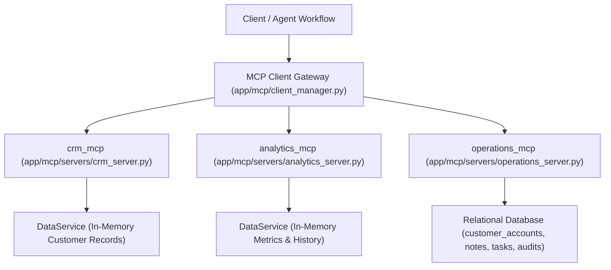

# Nexus AI: Orchestrated Multi-MCP Enterprise AI Agent Operations Platform

[](https://www.python.org/downloads/)
[](https://fastapi.tiangolo.com)
[](https://docs.llamaindex.ai)
[](https://github.com/facebookresearch/faiss)
[](tests/)

An enterprise-grade autonomous AI operations platform coordinating multiple **Model Context Protocol (MCP)** servers, **LlamaIndex Workflows**, dynamic database-driven agent playbooks, **FAISS vector search (RAG)** with anti-stale cache invalidation, **cross-chat cognitive memory**, and **cryptographic JWT authentication**.

Built with **FastAPI**, **LlamaIndex Workflows**, **FAISS**, **SQLAlchemy / SQLite**, **PyJWT**, and **Vanilla JavaScript** (Developer-Console Dark Slate/Zinc aesthetic, Zero Gradients, Zero Emojis).

---

## 📚 Complete Documentation Index

| Documentation File | Scope & Technical Contents |
| :--- | :--- |
| **[`summary.md`](summary.md)** | **Master Engineering Handbook & Unified Notes (3,500+ lines)**: Complete 5-Part reference compendium covering Platform Architecture, Database Schema, Backend & JWT Security, AI & MCP Engineering, and Testing & Evaluation Playbooks. |
| **[`database.md`](database.md)** | **Relational Database Reference**: Complete 14-table schema, Mermaid Entity-Relationship Diagrams (ERD), foreign keys, cascade rules, B-Tree indexes, and transactional session lifecycle. |
| **[`ai.md`](ai.md)** | **AI & Multi-Agent Engineering Handbook**: MCP JSON-RPC 2.0 specifications, Agent-to-Agent (A2A) topologies, FAISS vector math & cosine formulas, tokenomics, guardrails, and building without AI. |
| **[`backend.md`](backend.md)** | **Backend Architecture & Cryptographic Security**: FastAPI lifespan runtime, PBKDF2-HMAC-SHA256 password hashing, JWT bit-level anatomy, full round-trip sequence diagram, and step-by-step database traversal flow. |

---

## 1. Executive Mental Model

Modern enterprise AI platforms require coordinating tools, operational state, and context across fragmented systems:
- **CRM Systems (`crm_mcp`)**: Customer contracts, SLA commitments, account tiers, and stakeholders.
- **Analytics Engines (`analytics_mcp`)**: Live ARR, MRR, churn risk indicators, NPS scores, and platform usage metrics.
- **Transactional Operations (`operations_mcp`)**: Write-capable actions including customer account creation, status updates, team notes, and follow-up tasks.
- **Isolated Knowledge Bases (RAG)**: Partitioned vector search for technical specs, SLA escalation policies, and architecture blueprints.
- **Cognitive Cross-Chat Memory**: Automatic extraction of user facts, project constraints, and communication preferences.
- **Cryptographic Access Control**: PBKDF2 password hashing with 100,000 iterations and signed JWT tokens verified against active database records.

```text
USER / CLIENT APPLICATION
          │
          ▼  (HTTP POST / Bearer JWT)
   FASTAPI REST API (app/main.py, app/api/)
          │
          ├──▶ AUTHENTICATION & RBAC (PBKDF2-HMAC-SHA256, PyJWT + SQLite User Verification)
          ├──▶ INPUT GUARDRAILS (Prompt Injection & Harmful Content Detection)
          │
          ▼
   AGENT ORCHESTRATION ENGINE (app/workflow/agent_workflow.py)
   (Loaded dynamically from SQL: category, system prompt, playbook, permitted tools)
          │
          ├── 1. QUERY CLASSIFICATION (Deterministic intent detection & entity mapping)
          ├── 2. COGNITIVE MEMORY (Short-term dialogue turns + long-term user facts)
          ├── 3. ISOLATED RAG RETRIEVAL (FAISS IndexFlatIP cosine similarity search)
          ├── 4. MULTI-MCP TOOL EXECUTION (Permission-guarded execution across 3 servers)
          │      ├── CRM MCP Server (crm_mcp: profiles, SLAs, contracts)
          │      ├── Analytics MCP Server (analytics_mcp: metrics, ARR, churn)
          │      └── Operations MCP Server (operations_mcp: accounts, notes, tasks, audits)
          ├── 5. TEMPORARY RESEARCH SUB-AGENT (JSON payload condensation & noise reduction)
          └── 6. SYNTHESIS & OUTPUT GUARDRAILS (Groq LLM / Offline Grounded Engine)
          │
          ▼
   STRUCTURED OUTPUT + REAL-TIME SSE STREAMING + SANITIZED AUDIT TRACE (final_prompt.txt)
```

---

## 2. Multi-MCP Server Architecture

The platform runs three in-process servers conforming to Anthropic's **Model Context Protocol (MCP)**:



| Server ID | Type | Tools Provided | Data Backend |
| :--- | :--- | :--- | :--- |
| **`crm_mcp`** | Read | `CRM.get_customer`, `CRM.search_customers`, `CRM.append_customer_note` | In-memory CRM data service |
| **`analytics_mcp`** | Read | `Analytics.get_customer_metrics`, `Analytics.get_customer_history` | In-memory Analytics service |
| **`operations_mcp`** | Read & Write | `Operations.create_customer`, `Operations.list_customers`, `Operations.get_customer`, `Operations.update_customer_status`, `Operations.add_customer_note`, `Operations.get_customer_notes`, `Operations.create_follow_up_task`, `Operations.list_follow_up_tasks`, `Operations.update_follow_up_task_status`, `Operations.get_audit_history` | SQLite / SQLAlchemy persistent tables |

### Primary Demonstration Milestone
> **One configurable agent coordinates and executes tools from multiple distinct MCP servers in a single event-driven workflow.** For example, querying customer "ABC" triggers `CRM.get_customer` on `crm_mcp` followed by `Analytics.get_customer_metrics` on `analytics_mcp` before synthesizing a unified executive dossier.

---

## 3. Quick Start & Installation

### Prerequisites
- Python 3.10+ (Recommended: Python 3.11 or 3.12)
- Operating System: Windows, Linux, or macOS

### 1. Install Dependencies
```bash
pip install -r requirements.txt
```
*(On Windows using the Python Launcher: `py -3 -m pip install -r requirements.txt`)*

### 2. Configure Environment (Optional)
Create or edit `.env` in the project root:
```ini
APP_HOST=0.0.0.0
APP_PORT=8080
LLM_PROVIDER=groq
GROQ_API_KEY=your_groq_api_key_here
GROQ_MODEL=llama-3.3-70b-versatile
JWT_SECRET_KEY=super-secret-jwt-key-change-in-production-2026
JWT_EXPIRATION_HOURS=24
```
*Note: If no Groq or OpenAI key is configured, the platform automatically uses its **Deterministic Offline Grounded Engine**, ensuring zero crashed executions.*

### 3. Start the Server
```bash
python run.py
```
*(Or on Windows: `py -3 run.py`)*

### 4. Access the Platform
- **Operations Console**: [http://localhost:8080/](http://localhost:8080/)
- **Swagger Interactive API**: [http://localhost:8080/docs](http://localhost:8080/docs)
- **Component Health Diagnostics**: [http://localhost:8080/system/health](http://localhost:8080/system/health)

---

## 4. Key Architectural Features

### 4.1 Cryptographic Password Security & JWT Traversal
- **PBKDF2-HMAC-SHA256**: 100,000 iterations with unique 16-byte cryptographic salts (`os.urandom(16).hex()`) and constant-time comparison (`hmac.compare_digest`).
- **Hybrid JWT Architecture**: Tokens are signed statelessly via HMAC-SHA256, but every protected request executes `db.query(User).filter(User.user_id == sub, User.is_active == True)`. This guarantees **instant token revocation upon account deactivation** and ensures fresh user roles for RBAC.
- **LLM Context Personalization**: The authenticated user's profile (`user.to_llm_profile()`) is injected into agent prompts, formatting responses in the user's preferred currency and style.

### 4.2 Dynamic Vector RAG & Anti-Stale Cache
- **Embedding Space**: 384-dimensional dense vectors with L2 normalization for exact cosine similarity via FAISS `IndexFlatIP`.
- **Partition Isolation**: Knowledge bases are partitioned (`customer_docs`, `company_policies`, `technical_docs`). Agents can only retrieve chunks from permitted partitions.
- **Zero Stale Vectors**: When a document is deleted via `DELETE /knowledge/documents/{id}`, its vector representations and chunks are **synchronously deleted from FAISS**.

### 4.3 Multi-Tier Cognitive Memory
- **Short-Term Memory**: Sliding window conversation history tracking recent dialogue turns per session.
- **Long-Term Fact Storage**: Persistent entity facts with semantic importance scores.
- **Cross-Chat Memory Extraction**: Automatic extraction of durable user facts (e.g., `"user is preparing for Q4 renewal"`) that persist across completely separate chat sessions.

### 4.4 Enterprise Alignment Guardrails
- **Prompt Injection Defense**: Regex and heuristic detection of jailbreaks, roleplay subversion, and delimiter attacks.
- **Harmful Content Filtering**: Scans user inputs for dangerous exploits and system overrides.
- **Tool Argument Validation**: Prevents injection payloads from reaching MCP tool execution handlers.
- **Secret Scrubbing**: Strips API keys (`sk-...`, `gsk_...`), Bearer tokens, and sensitive passwords from logs and `final_prompt.txt`.

---

## 5. Automated Test Suite (52/52 Tests Passing)

The repository includes a comprehensive automated test suite covering all functional, architectural, security, and regression capabilities:

```bash
pytest tests/ -v
```

### Test Suite Inventory:

| Test File | Test Count | Domain Covered |
| :--- | :---: | :--- |
| **`tests/test_alignment_guardrails.py`** | 5 | Prompt injection, harmful queries, tool argument guards, and secret redaction. |
| **`tests/test_api_endpoints.py`** | 9 | API health, agent config updates, executions, SSE streaming, and MCP reflection. |
| **`tests/test_auth_and_user_sessions.py`** | 7 | Demo accounts, PBKDF2 verification, JWT token issuance, and multi-session isolation. |
| **`tests/test_rag_retrieval.py`** | 3 | Semantic chunking, embedding generation, and FAISS partition isolation. |
| **`tests/test_system_audit_regression.py`** | 23 | Operations MCP CRUD, self-correction, retry metadata, tool priority, and audit logs. |
| **`tests/test_user_cross_chat_memory.py`** | 4 | Automatic user fact extraction, memory endpoints, cross-account isolation, and noise filtering. |
| **`tests/test_workflow_run.py`** | 1 | End-to-end multi-step LlamaIndex workflow execution. |
| **Total** | **52 Tests** | **100% Passing** |

---

## 6. REST API Reference (Core Endpoints)

| Endpoint | Method | Description |
| :--- | :--- | :--- |
| **`/auth/login`** | `POST` | Authenticate user credentials and return signed JWT Bearer token |
| **`/auth/register`** | `POST` | Register a new user account with PBKDF2 password hashing |
| **`/auth/me`** | `GET` | Get profile for currently authenticated Bearer token |
| **`/agents`** | `GET` / `POST` | List all registered agents or create a new agent |
| **`/agents/{id}/config`** | `GET` / `PUT` | Read or dynamically update agent system prompt and playbooks |
| **`/agents/{id}/run`** | `POST` | Execute agent workflow synchronously with user query |
| **`/agents/{id}/stream`** | `GET` | Real-time Server-Sent Events (SSE) execution stream |
| **`/executions`** | `GET` | List historical executions with latency and status |
| **`/executions/{id}/trace`** | `GET` | Step-by-step trace with payloads and millisecond timings |
| **`/executions/{id}/prompt`** | `GET` | Retrieve sanitized prompt audit trail (`final_prompt.txt`) |
| **`/mcp/servers`** | `GET` | List registered MCP servers and connection status |
| **`/mcp/tools`** | `GET` | Catalog of dynamically discovered MCP tools |
| **`/knowledge/bases`** | `GET` / `POST` | Inspect or create isolated knowledge base partitions |
| **`/knowledge/upload`** | `POST` | Upload and vectorize document into FAISS |
| **`/memory/conversations`** | `GET` | List dialogue sessions for authenticated user |
| **`/system/health`** | `GET` | Component diagnostics (Database, Vector Store, LLM, MCP) |

---

## 7. UI Console Design Principles

- **Dark Slate / Zinc Aesthetic**: Clean `#09090b` console base with `#121215` panel cards and `#2a2a30` borders.
- **Zero Gradients & Zero Emojis**: Crisp developer console aesthetic using clean SVG icons and monospaced telemetry badges.
- **Dual Execution Views**:
  - *Simple View*: Executive grounded summary, source cards, and tool badges.
  - *Technical View*: Step-by-step execution timeline, per-step millisecond timings, raw MCP JSON payloads, sanitized prompt traces, and memory context.

---

## 8. License

This project is licensed under the Apache 2.0 License.
