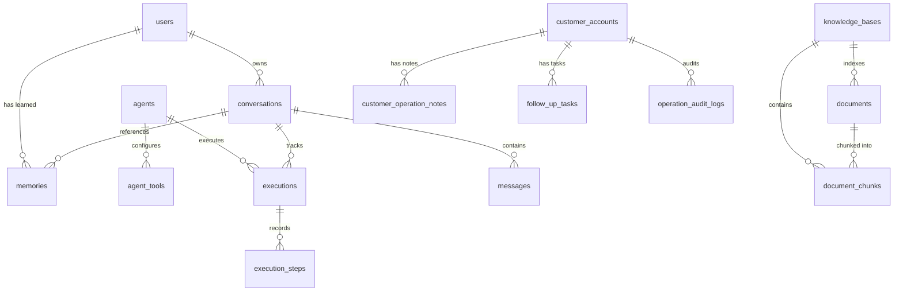

# Enterprise Database Schema & Architecture Reference

This document provides a comprehensive, production-grade reference for the entire database architecture powering the Enterprise Autonomous Agent Platform. It details all tables, columns, data types, indexes, foreign keys, cascade constraints, entity relationships, and access patterns.

---

## 1. Architectural Overview & Entity-Relationship Model

The database is built on **SQLAlchemy ORM** and supports both **PostgreSQL** (production) and **SQLite** (development/test) with multi-threaded thread-safe connection pooling.

---

## 2. Detailed Table Specifications

### 2.1. User Management & Authentication (`users`)

Manages user identity, secure authentication credentials, enterprise personas, role-based access control (RBAC), and user-level preferences.

| Column Name | Type | Constraints | Default | Description |
| :--- | :--- | :--- | :--- | :--- |
| `id` | `INTEGER` | Primary Key, Autoincrement | — | Internal numeric record identifier. |
| `user_id` | `VARCHAR(64)` | Unique, Not Null, Indexed | — | Canonical enterprise user UUID (e.g. `usr_sarah_01`). |
| `email` | `VARCHAR(128)` | Unique, Not Null, Indexed | — | Corporate email address for login. |
| `username` | `VARCHAR(64)` | Unique, Not Null, Indexed | — | Unique login username. |
| `hashed_password` | `VARCHAR(256)` | Not Null | — | Cryptographically salted SHA-256 password hash. |
| `salt` | `VARCHAR(64)` | Not Null | — | Unique per-user cryptographic salt. |
| `full_name` | `VARCHAR(128)` | Not Null | — | Full display name (e.g. "Sarah Chen"). |
| `role` | `VARCHAR(64)` | Not Null | `'Account Executive'` | Enterprise role used for RBAC guardrails (e.g. `Admin`, `Executive Leadership`, `Lead Support Operations Architect`). |
| `department` | `VARCHAR(64)` | Not Null | `'Customer Operations'` | Organizational unit/department. |
| `responsibilities` | `TEXT` | Nullable | `'Account Management...'`| Stated duties and focus areas used for prompt personalization. |
| `preferences` | `JSON` | Nullable | `{"concise_mode": false, ...}` | Cross-session user preferences (currency, timezone, output format). |
| `is_active` | `BOOLEAN` | Not Null | `TRUE` | Account active/disabled status flag. |
| `created_at` | `DATETIME` | Not Null | `utcnow()` | Timestamp of account registration. |
| `updated_at` | `DATETIME` | Not Null | `utcnow()`, OnUpdate | Timestamp of last profile modification. |

---

### 2.2. Autonomous Agent Definitions (`agents`)

Defines autonomous agent configurations, system prompts, operational playbooks, LLM parameters, memory switches, and knowledge base associations.

| Column Name | Type | Constraints | Default | Description |
| :--- | :--- | :--- | :--- | :--- |
| `agent_id` | `VARCHAR(64)` | Primary Key, Indexed | — | Unique agent identifier (e.g. `luna`, `customer_operations_agent`). |
| `agent_name` | `VARCHAR(128)` | Not Null | — | Human-readable agent display name. |
| `category` | `VARCHAR(64)` | Not Null | `'General'` | Functional classification (e.g. `Executive Support`, `Operations`). |
| `description` | `TEXT` | Nullable | — | Purpose and high-level capability summary. |
| `system_prompt` | `TEXT` | Not Null | — | Core persona, safety boundaries, and behavioural prompt. |
| `playbook` | `TEXT` | Not Null | — | Step-by-step domain procedure guidelines and SOP instructions. |
| `model` | `VARCHAR(64)` | Not Null | `'gpt-4o-mini'` | LLM model identifier (e.g. `openai/gpt-oss-20b`, `gpt-4o-mini`). |
| `temperature` | `FLOAT` | Not Null | `0.2` | Sampling temperature for LLM inference (0.0 = deterministic). |
| `memory_configuration` | `JSON` | Nullable | `{"short_term": true, ...}` | Enables/disables short-term and cross-chat memory pipelines. |
| `workflow_configuration` | `JSON` | Nullable | `{"max_iterations": 10, ...}`| Workflow settings (sub-agent delegation, RAG binding, iteration limits). |
| `enabled` | `BOOLEAN` | Not Null | `TRUE` | Global agent activation switch. |
| `created_at` | `DATETIME` | Not Null | `utcnow()` | Timestamp of agent creation. |
| `updated_at` | `DATETIME` | Not Null | `utcnow()`, OnUpdate | Timestamp of last configuration update. |

**Relationships:**
- `tools`: 1-to-many with `agent_tools` (`cascade="all, delete-orphan"`).
- `executions`: 1-to-many with `executions` (`cascade="all, delete-orphan"`).

---

### 2.3. Agent Tool Bindings (`agent_tools`)

Enforces the principle of least privilege by explicitly mapping permitted Model Context Protocol (MCP) tools to specific agents.

| Column Name | Type | Constraints | Default | Description |
| :--- | :--- | :--- | :--- | :--- |
| `id` | `INTEGER` | Primary Key, Autoincrement | — | Record identifier. |
| `agent_id` | `VARCHAR(64)` | Foreign Key (`agents.agent_id` ON DELETE CASCADE), Indexed | — | Parent agent identifier. |
| `tool_name` | `VARCHAR(128)` | Not Null, Indexed | — | Fully-qualified MCP tool name (e.g. `CRM.get_customer`, `Operations.add_customer_note`). |
| `server_id` | `VARCHAR(64)` | Not Null | — | Associated MCP server identifier. |
| `enabled` | `BOOLEAN` | Not Null | `TRUE` | Tool permission toggle for this agent. |
| `created_at` | `DATETIME` | Not Null | `utcnow()` | Timestamp of tool permission grant. |

---

### 2.4. MCP Servers Catalog (`mcp_servers`)

Stores metadata and communication protocols for connected Model Context Protocol (MCP) tool servers.

| Column Name | Type | Constraints | Default | Description |
| :--- | :--- | :--- | :--- | :--- |
| `server_id` | `VARCHAR(64)` | Primary Key, Indexed | — | Unique server name (e.g. `crm_server`, `analytics_server`, `operations_server`). |
| `server_name` | `VARCHAR(128)` | Not Null | — | Display name. |
| `server_url` | `VARCHAR(256)` | Nullable | — | Endpoint URL or script entrypoint path. |
| `transport` | `VARCHAR(32)` | Not Null | `'inprocess'` | Transport protocol: `inprocess`, `stdio`, or `sse`. |
| `configuration` | `JSON` | Nullable | `{}` | Runtime connection credentials and tool schemas. |
| `enabled` | `BOOLEAN` | Not Null | `TRUE` | Server activation status. |
| `created_at` | `DATETIME` | Not Null | `utcnow()` | Timestamp of server registration. |
| `updated_at` | `DATETIME` | Not Null | `utcnow()`, OnUpdate | Timestamp of last modification. |

---

### 2.5. Chat Conversations & Multi-Session Tracking (`conversations`)

Maintains separate conversational contexts per user and agent, supporting multiple isolated chat tabs with automatic title generation.

| Column Name | Type | Constraints | Default | Description |
| :--- | :--- | :--- | :--- | :--- |
| `conversation_id` | `VARCHAR(64)` | Primary Key, Indexed | — | Unique conversation UUID (e.g. `conv_sarah_01`). |
| `agent_id` | `VARCHAR(64)` | Not Null, Indexed | — | Associated agent identifier. |
| `title` | `VARCHAR(256)` | Nullable | `'New Chat'` | Dynamic conversational title summarized from first query. |
| `session_id` | `VARCHAR(64)` | Nullable, Indexed | — | Browser/device session grouping identifier. |
| `user_id` | `VARCHAR(64)` | Nullable, Indexed | — | Owner user UUID for multi-user isolation. |
| `metadata_json` | `JSON` | Nullable | `{}` | Extensible session state and metadata. |
| `created_at` | `DATETIME` | Not Null | `utcnow()` | Timestamp when conversation began. |
| `updated_at` | `DATETIME` | Not Null | `utcnow()`, OnUpdate | Timestamp of most recent activity. |

**Relationships:**
- `messages`: 1-to-many with `messages` (`cascade="all, delete-orphan"`).

---

### 2.6. Conversation Turns & History (`messages`)

Stores chronological dialogue turns (user queries, assistant answers, system notices, tool payloads) with token consumption metrics.

| Column Name | Type | Constraints | Default | Description |
| :--- | :--- | :--- | :--- | :--- |
| `id` | `INTEGER` | Primary Key, Autoincrement | — | Record identifier. |
| `conversation_id` | `VARCHAR(64)` | Foreign Key (`conversations.conversation_id` ON DELETE CASCADE), Indexed | — | Parent conversation identifier. |
| `role` | `VARCHAR(32)` | Not Null | — | Message sender: `user`, `assistant`, `system`, or `tool`. |
| `content` | `TEXT` | Not Null | — | Raw message text content. |
| `token_count` | `INTEGER` | Not Null | `0` | Estimated word/token count for context window management. |
| `created_at` | `DATETIME` | Not Null | `utcnow()` | Timestamp of message creation. |

---

### 2.7. Cross-Chat Long-Term Memory & User Facts (`memories`)

Powers semantic cross-session memory. Automatically stores distilled user facts, business metrics, entity context, and stated preferences while filtering out noise.

| Column Name | Type | Constraints | Default | Description |
| :--- | :--- | :--- | :--- | :--- |
| `id` | `INTEGER` | Primary Key, Autoincrement | — | Record identifier. |
| `user_id` | `VARCHAR(64)` | Nullable, Indexed | — | Owner user UUID (for user-specific cross-chat facts). |
| `conversation_id` | `VARCHAR(64)` | Nullable, Indexed | — | Originating conversation identifier. |
| `entity_key` | `VARCHAR(128)` | Nullable, Indexed | — | Semantic key (e.g. `user:usr_sarah_01`, `customer:ABC`). |
| `memory_type` | `VARCHAR(32)` | Not Null | `'long_term_fact'`| Type: `user_preference`, `user_context`, `business_metric`, `customer_fact`. |
| `content` | `TEXT` | Not Null | — | Distilled, high-signal factual statement. |
| `importance_score`| `FLOAT` | Not Null | `1.0` | Weight score (1.0 to 1.8) for relevance ranking during retrieval. |
| `created_at` | `DATETIME` | Not Null | `utcnow()` | Timestamp of memory distillation. |

---

### 2.8. Workflow Execution Lifecycle (`executions`)

Records high-level metadata, status, prompt audit file paths, and execution latency for each agent run.

| Column Name | Type | Constraints | Default | Description |
| :--- | :--- | :--- | :--- | :--- |
| `execution_id` | `VARCHAR(64)` | Primary Key, Indexed | — | Unique execution run UUID. |
| `agent_id` | `VARCHAR(64)` | Foreign Key (`agents.agent_id` ON DELETE CASCADE), Indexed | — | Executing agent identifier. |
| `conversation_id` | `VARCHAR(64)` | Nullable, Indexed | — | Context conversation UUID. |
| `session_id` | `VARCHAR(64)` | Nullable, Indexed | — | Client session UUID. |
| `query` | `TEXT` | Not Null | — | Incoming user prompt / instruction. |
| `final_answer` | `TEXT` | Nullable | — | Synthesized Markdown response returned to user. |
| `status` | `VARCHAR(32)` | Not Null | `'running'` | Execution state: `running`, `completed`, `failed`, `blocked_by_guardrail`. |
| `duration_ms` | `FLOAT` | Not Null | `0.0` | Total end-to-end execution latency in milliseconds. |
| `prompt_file_path` | `VARCHAR(256)` | Nullable | — | Absolute filesystem path to immutable, redacted prompt audit log. |
| `created_at` | `DATETIME` | Not Null | `utcnow()` | Timestamp when execution started. |

**Relationships:**
- `steps`: 1-to-many with `execution_steps` (`cascade="all, delete-orphan"`, `order_by="ExecutionStep.step_number"`).

---

### 2.9. Execution Telemetry & Step Logs (`execution_steps`)

Provides step-by-step auditability for every phase of the LlamaIndex workflow (query classification, memory load, tool planning, guardrail validation, tool calls, sub-agent condensation, LLM synthesis).

| Column Name | Type | Constraints | Default | Description |
| :--- | :--- | :--- | :--- | :--- |
| `id` | `INTEGER` | Primary Key, Autoincrement | — | Record identifier. |
| `execution_id` | `VARCHAR(64)` | Foreign Key (`executions.execution_id` ON DELETE CASCADE), Indexed | — | Parent execution run UUID. |
| `step_number` | `INTEGER` | Not Null | — | Sequential step index (1, 2, 3...). |
| `step_name` | `VARCHAR(128)` | Not Null | — | Name (e.g. `load_agent_and_classify`, `execute_mcp_tool:CRM.get_customer`). |
| `tool_name` | `VARCHAR(128)` | Nullable | — | Invoked tool name (if applicable). |
| `input_payload` | `JSON` | Nullable | — | Step input parameters, resolved arguments, or classifier output. |
| `output_payload`| `JSON` | Nullable | — | Tool return dictionary, retrieved context count, or response preview. |
| `duration_ms` | `FLOAT` | Not Null | `0.0` | Step execution duration in milliseconds. |
| `status` | `VARCHAR(32)` | Not Null | `'completed'` | Status: `completed`, `failed`, `skipped`. |
| `error_message` | `TEXT` | Nullable | — | Error description if step failed. |
| `created_at` | `DATETIME` | Not Null | `utcnow()` | Timestamp when step was logged. |

---

### 2.10. Knowledge Bases (`knowledge_bases`)

Manages document collections and chunking/embedding hyperparameters for retrieval-augmented generation (RAG).

| Column Name | Type | Constraints | Default | Description |
| :--- | :--- | :--- | :--- | :--- |
| `kb_id` | `VARCHAR(64)` | Primary Key, Indexed | — | Unique knowledge base UUID (e.g. `customer_docs`). |
| `name` | `VARCHAR(128)` | Not Null | — | Display name (e.g. "Enterprise Customer Documents"). |
| `description` | `TEXT` | Nullable | — | Summary of indexed content. |
| `folder_path` | `VARCHAR(256)` | Not Null | — | Root storage directory path for documents. |
| `chunk_size` | `INTEGER` | Not Null | `400` | Target word/token size per chunk. |
| `chunk_overlap` | `INTEGER` | Not Null | `50` | Overlap word/token count between adjacent chunks. |
| `embedding_model`| `VARCHAR(64)` | Not Null | `'default-embeddings'`| Embedding model name (384-dim normalized vectors). |
| `created_at` | `DATETIME` | Not Null | `utcnow()` | Timestamp of KB initialization. |

---

### 2.11. Indexed Documents (`documents`)

Tracks individual uploaded/indexed files within a Knowledge Base.

| Column Name | Type | Constraints | Default | Description |
| :--- | :--- | :--- | :--- | :--- |
| `id` | `INTEGER` | Primary Key, Autoincrement | — | Record identifier. |
| `kb_id` | `VARCHAR(64)` | Foreign Key (`knowledge_bases.kb_id` ON DELETE CASCADE), Indexed | — | Parent Knowledge Base identifier. |
| `filename` | `VARCHAR(256)` | Not Null | — | File name (e.g. `apple_10k_2023.txt`, `customer_onboarding_guide.md`). |
| `file_type` | `VARCHAR(32)` | Not Null | — | File extension/type (`txt`, `md`, `pdf`). |
| `file_size` | `INTEGER` | Not Null | — | File size in bytes. |
| `content_hash` | `VARCHAR(64)` | Nullable | — | SHA-256 hash for deduplication and change detection. |
| `created_at` | `DATETIME` | Not Null | `utcnow()` | Timestamp of document indexing. |

---

### 2.12. Document Chunks & Vector Mapping (`document_chunks`)

Stores indexed text chunks linked to FAISS dense vector store IDs.

| Column Name | Type | Constraints | Default | Description |
| :--- | :--- | :--- | :--- | :--- |
| `id` | `INTEGER` | Primary Key, Autoincrement | — | Record identifier. |
| `document_id` | `INTEGER` | Foreign Key (`documents.id` ON DELETE CASCADE), Indexed | — | Parent document identifier. |
| `kb_id` | `VARCHAR(64)` | Foreign Key (`knowledge_bases.kb_id` ON DELETE CASCADE), Indexed | — | Parent Knowledge Base identifier. |
| `chunk_index` | `INTEGER` | Not Null | — | 0-based chunk order within document. |
| `content` | `TEXT` | Not Null | — | Text content of the chunk. |
| `token_count` | `INTEGER` | Not Null | `0` | Estimated token count. |
| `vector_id` | `INTEGER` | Nullable, Indexed | — | Index pointer inside FAISS vector store. |
| `created_at` | `DATETIME` | Not Null | `utcnow()` | Timestamp of chunk generation. |

---

### 2.13. Customer Master Accounts (`customer_accounts`)

Master relational CRM entity records managed by the `CustomerOperationsAgent`.

| Column Name | Type | Constraints | Default | Description |
| :--- | :--- | :--- | :--- | :--- |
| `id` | `INTEGER` | Primary Key, Autoincrement | — | Internal numeric record identifier. |
| `customer_id` | `VARCHAR(64)` | Unique, Not Null, Indexed | — | Canonical customer ID (e.g. `ABC`, `CUST001`). |
| `company_name` | `VARCHAR(256)` | Not Null | — | Company name (e.g. "Acme Corporation"). |
| `status` | `VARCHAR(32)` | Not Null | `'active'` | Status: `active`, `churned`, `inactive`, `suspended`. |
| `renewal_date` | `DATE` | Nullable | — | Contract renewal date. |
| `owner` | `VARCHAR(128)` | Nullable | — | Assigned account executive / owner. |
| `created_at` | `DATETIME` | Not Null | `utcnow()` | Timestamp of creation. |
| `updated_at` | `DATETIME` | Not Null | `utcnow()`, OnUpdate | Timestamp of last record update. |

---

### 2.14. Customer Operation Notes (`customer_operation_notes`)

Notes and interaction logs attached to customer accounts.

| Column Name | Type | Constraints | Default | Description |
| :--- | :--- | :--- | :--- | :--- |
| `id` | `INTEGER` | Primary Key, Autoincrement | — | Record identifier. |
| `customer_id` | `INTEGER` | Foreign Key (`customer_accounts.id` ON DELETE CASCADE), Indexed | — | Foreign key to `customer_accounts.id`. |
| `note` | `TEXT` | Not Null | — | Freeform note or meeting record. |
| `created_by` | `VARCHAR(128)` | Not Null | — | Author name or agent identifier. |
| `created_at` | `DATETIME` | Not Null | `utcnow()` | Timestamp of note entry. |

---

### 2.15. Customer Follow-Up Tasks (`follow_up_tasks`)

Action items and tasks created during agent operations.

| Column Name | Type | Constraints | Default | Description |
| :--- | :--- | :--- | :--- | :--- |
| `id` | `INTEGER` | Primary Key, Autoincrement | — | Record identifier. |
| `customer_id` | `INTEGER` | Foreign Key (`customer_accounts.id` ON DELETE CASCADE), Indexed | — | Foreign key to `customer_accounts.id`. |
| `title` | `VARCHAR(256)` | Not Null | — | Task title / description. |
| `due_date` | `DATE` | Nullable | — | Target completion date. |
| `status` | `VARCHAR(32)` | Not Null | `'open'` | Status: `open`, `completed`, `cancelled`. |
| `created_by` | `VARCHAR(128)` | Not Null | — | Author name or agent identifier. |
| `created_at` | `DATETIME` | Not Null | `utcnow()` | Timestamp of task creation. |

---

### 2.16. Operations Audit Log (`operation_audit_logs`)

Immutable audit trail logging every mutation made by autonomous agents across the platform.

| Column Name | Type | Constraints | Default | Description |
| :--- | :--- | :--- | :--- | :--- |
| `id` | `INTEGER` | Primary Key, Autoincrement | — | Record identifier. |
| `agent_id` | `VARCHAR(64)` | Not Null, Indexed | — | Agent that triggered the action. |
| `tool_name` | `VARCHAR(128)` | Not Null | — | Tool invoked (e.g. `Operations.update_customer_status`). |
| `customer_id` | `VARCHAR(64)` | Nullable, Indexed | — | Target customer identifier. |
| `action` | `VARCHAR(64)` | Not Null | — | Action description (`create_customer`, `update_status`, `add_note`). |
| `old_value` | `TEXT` | Nullable | — | Prior value before mutation (for audit diffs). |
| `new_value` | `TEXT` | Nullable | — | New value after mutation. |
| `success` | `BOOLEAN` | Not Null | `FALSE` | Success/failure status of the mutation. |
| `created_at` | `DATETIME` | Not Null | `utcnow()` | Timestamp of audit event. |

---

## 3. Indexing & Query Optimization Strategy

1. **Composite & Entity Filtering**:
   - `conversations(user_id, agent_id)` and `conversations(conversation_id)` enable sub-millisecond retrieval of user conversation histories and sidebar tabs.
   - `memories(user_id, entity_key)` enables instant cross-chat user preference loading.
2. **Cascade Deletions (`ON DELETE CASCADE`)**:
   - Deleting a `conversation` automatically deletes its `messages`.
   - Deleting an `agent` automatically cascades to its `agent_tools` and `executions`.
   - Deleting a `customer_account` automatically cascades to its `notes` and `tasks`.
   - Deleting a `document` or `knowledge_base` cascades to its `document_chunks`.
3. **Multi-Threaded Concurrency**:
   - SQLite uses `check_same_thread=False` and connection timeouts to handle asynchronous FastAPI worker threads without database locks.
   - In production PostgreSQL, connection pooling uses `pool_size=10, max_overflow=20`.

---

## 4. Safe Auto-Migration Engine (`ensure_schema_columns`)

The platform contains an idempotent startup schema migrator in `app/database.py` that checks and adds missing columns on boot (e.g., `session_id`, `user_id`, `title`) without data loss or downtime.
