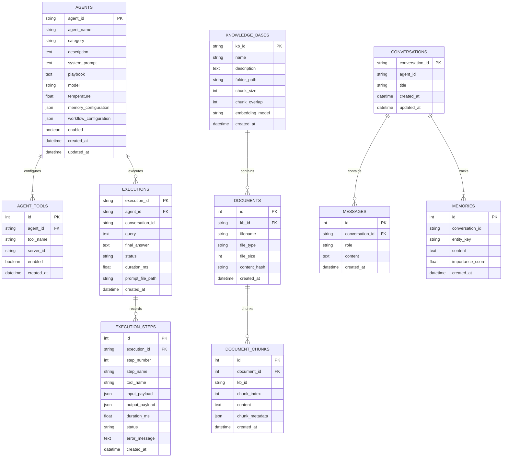

# Nexus AI — Complete Platform Summary & Architectural Specification

> **Platform:** Nexus AI Orchestrated Multi-MCP AI Agent Operations Platform  
> **Host Port:** `8080` (`http://127.0.0.1:8080`)  
> **Backend Architecture:** FastAPI, LlamaIndex Workflows, SQLAlchemy, SQLite, FAISS Vector Search  
> **LLM Layer:** Groq API (`llama-3.3-70b-versatile` / OpenAI-compatible) + Deterministic Offline Grounding Fallback  
> **Design Philosophy:** Developer-Console Dark Slate/Zinc aesthetic, Zero Gradients, Zero Emojis  

---

## Table of Contents
1. [Executive Overview & Primary Demonstration Goal](#1-executive-overview--primary-demonstration-goal)
2. [Academic Demonstration Matrix](#2-academic-demonstration-matrix)
3. [System Architecture & End-to-End Flow](#3-system-architecture--end-to-end-flow)
   - [3.1 High-Level Architecture](#31-high-level-architecture)
   - [3.2 End-to-End Sequence Diagram](#32-end-to-end-sequence-diagram)
4. [Component Deep Dives](#4-component-deep-dives)
   - [4.1 Multi-MCP Server Subsystem (Dual Servers)](#41-multi-mcp-server-subsystem-dual-servers)
   - [4.2 LlamaIndex Event-Driven Workflow Engine](#42-llamaindex-event-driven-workflow-engine)
   - [4.3 Dynamic Knowledge Retrieval (RAG & FAISS)](#43-dynamic-knowledge-retrieval-rag--faiss)
   - [4.4 Dual-Tier Memory System](#44-dual-tier-memory-system)
   - [4.5 Temporary Research Sub-Agents & Context Condensation](#45-temporary-research-sub-agents--context-condensation)
   - [4.6 Smart Query Classification & Dynamic Guardrails](#46-smart-query-classification--dynamic-guardrails)
   - [4.7 Multi-Provider LLM Engine & Zero-Cost Offline Fallback](#47-multi-provider-llm-engine--zero-cost-offline-fallback)
   - [4.8 Audit Logging, Secret Sanitization & Prompt Traces](#48-audit-logging-secret-sanitization--prompt-traces)
5. [Database Schema & Data Models (SQLite / SQLAlchemy)](#5-database-schema--data-models-sqlite--sqlalchemy)
6. [Mathematical & Algorithmic Formulations](#6-mathematical--algorithmic-formulations)
7. [Frontend / Web Control Center Guide](#7-frontend--web-control-center-guide)
   - [7.1 Visual Style System (Dark Slate Console)](#71-visual-style-system-dark-slate-console)
   - [7.2 View-by-View Walkthrough (7 Platform Views)](#72-view-by-view-walkthrough-7-platform-views)
   - [7.3 Dual Execution Modes: Simple View vs. Technical View](#73-dual-execution-modes-simple-view-vs-technical-view)
8. [Concrete Payload & Output Examples](#8-concrete-payload--output-examples)
9. [REST API Reference & Endpoints](#9-rest-api-reference--endpoints)
10. [Repository File & Directory Structure](#10-repository-file--directory-structure)
11. [Automated Test Suite (23/23 Tests Exhaustively Detailed)](#11-automated-test-suite-2323-tests-exhaustively-detailed)
12. [Academic Reviewer Evaluation Playbook (Step-by-Step)](#12-academic-reviewer-evaluation-playbook-step-by-step)
13. [Bugs, Issues & Difficulties Faced (Root Cause & Resolution)](#13-bugs-issues--difficulties-faced-root-cause--resolution)
14. [Comprehensive A-to-Z Testing & Verification Manual](#14-comprehensive-a-to-z-testing--verification-manual)
15. [Academic Defense & Technical FAQ (Every Question Anyone Could Ask)](#15-academic-defense--technical-faq-every-question-anyone-could-ask)

---

## 1. Executive Overview & Primary Demonstration Goal

**Nexus AI** is an enterprise-grade AI agent operations platform designed to solve the tool orchestration and context fragmentation challenges of modern LLM applications. 

Rather than functioning as a simplistic chatbot or raw log viewer, Nexus AI operates as an **AI Operations / Agent Control Center** that dynamically loads agent playbooks from database records, connects to independent Model Context Protocol (MCP) tool servers, conducts vector semantic search using isolated knowledge partitions, maintains dual-tier conversation and entity memory, and logs comprehensive sanitized audit trails.

### The Primary Academic Demonstration
The single most critical requirement for the technical evaluation is:
> **One configurable agent must coordinate and execute tools from at least two different MCP servers in the same workflow.**

The complete flow makes this multi-stage orchestration immediately apparent in both code and user interface:

```text
User Query
    │
    ▼
Configured Agent (Loaded from SQLite: Prompt + Playbook + Tool Permissions)
    │
    ▼
Smart Query Classifier (Intent Detection & Required Resource Mapping)
    │
    ├──▶ Short-Term & Long-Term Memory (Session Dialogue + Entity Facts)
    ├──▶ RAG Vector Store (FAISS Cosine Similarity Search)
    ├──▶ CRM MCP Server (Port 8001: Customer Profile, Tier, SLA)
    ├──▶ Analytics MCP Server (Port 8002: ARR, Churn Risk, NPS, Telemetry)
    └──▶ Temporary Sub-Agent (Raw JSON Result Condensation)
    │
    ▼
Context Synthesis & Groq LLM (llama-3.3-70b-versatile)
    │
    ▼
Final Grounded Response + Execution Trace + Sanitized final_prompt.txt
```

---

## 2. Academic Demonstration Matrix

Every core requirement specified for the technical evaluation is implemented, verified, and exposed in both the UI and REST API:

| Requirement | Implementation Architecture | Code Location | Verification Endpoint / Test |
| :--- | :--- | :--- | :--- |
| **Multi-MCP Tool Coordination** | Two distinct MCP servers (`crm_mcp` on 8001, `analytics_mcp` on 8002) coordinated in a single workflow. | `app/mcp/servers/`, `app/mcp/client_manager.py` | `POST /agents/{agent_id}/run`, `test_multi_mcp_execution_success` |
| **Dynamic Tool Discovery** | Dynamic reflection of tool schemas without hardcoding server internals. | `mcp_client_manager.discover_tools()` | `GET /mcp/tools`, `test_mcp_tool_discovery` |
| **Agent-Level Tool Permissions** | Database-driven permissions checking. Unauthorized tools raise `ToolPermissionError`. | `app/mcp/client_manager.py:execute_tool()` | `test_agent_level_tool_permission_enforcement` |
| **LlamaIndex Workflows** | Event-driven sequential pipeline (`StartEvent` ➔ `AgentLoadedEvent` ➔ `MemoryAndRAGLoadedEvent` ➔ `ToolPlanGeneratedEvent` ➔ `ToolsExecutedEvent` ➔ `ContextCondensedEvent` ➔ `StopEvent`). | `app/workflow/agent_workflow.py` | `test_end_to_end_agent_workflow` |
| **RAG with Vector Search** | FAISS `IndexFlatIP` with normalized sentence embeddings and isolated KB partitions. | `app/rag/vector_store.py`, `app/rag/ingest.py` | `GET /knowledge/documents`, `test_faiss_search_and_kb_isolation` |
| **Anti-Stale Cache / Zero Stale Cache** | Synchronous FAISS vector invalidation when documents are deleted or re-indexed. | `app/rag/ingest.py:delete_document()` | `DELETE /knowledge/documents/{id}`, `test_delete_document_purges_vectors_from_faiss` |
| **Dual-Tier Memory** | Short-term sliding-window conversation turns + long-term persistent entity facts. | `app/memory/memory_manager.py` | `GET /memory/conversations`, `GET /memory/items`, `test_delete_long_term_memory` |
| **Temporary Sub-Agents** | Lightweight context condensation sub-agent that summarizes high-volume raw JSON payloads before final LLM synthesis. | `app/workflow/subagent.py` | `test_end_to_end_agent_workflow` |
| **Prompt Engineering & Playbooks** | Dynamic agent system prompt and step-by-step reasoning playbook loaded from database. | `app/models/agent.py`, `app/api/agents.py` | `GET /agents/{agent_id}`, `agentConfigModal` |
| **Audit Logging & Secret Scrubbing** | Execution log files (`final_prompt.txt`) written to disk with regex scrubbing of API keys/tokens. | `app/workflow/agent_workflow.py:redact_secrets()` | `GET /executions/{id}/prompt`, `redact_secrets()` |
| **Zero Silent Fallbacks** | If demo data is cleared or deleted, MCP tools report "Not found" explicitly instead of silently fabricating dummy data. | `app/services/data_service.py` | `POST /data/demo/clear`, `test_zero_silent_fallback_on_missing_crm_customer` |

---

## 3. System Architecture & End-to-End Flow

### 3.1 High-Level Architecture

```
                      +---------------------------------------+
                      |         BROWSER CLIENT / UI           |
                      |   (http://127.0.0.1:8080 / Swagger)   |
                      +---------------------------------------+
                                          |
                                          | HTTP / JSON
                                          v
                      +---------------------------------------+
                      |           FASTAPI APPLICATION         |
                      |   app/main.py (Port 8080, Lifespan)   |
                      +---------------------------------------+
                                          |
                     +--------------------+--------------------+
                     |                                         |
                     v                                         v
         +-----------------------+                 +-----------------------+
         |      API ROUTERS      |                 |  DATABASE & STORAGE   |
         | /agents, /executions  |                 | SQLite (SessionLocal) |
         | /knowledge, /mcp      |                 | FAISS Vector Index    |
         | /memory, /system      |                 | demo_data/ (JSON)     |
         +-----------------------+                 +-----------------------+
                     |
                     v
         +-------------------------------------------------------------+
         |                 LLAMAINDEX WORKFLOW ENGINE                  |
         |           (app/workflow/agent_workflow.py)                  |
         |                                                             |
         | 1. step_load_agent                                          |
         |    - Query Classifier (Intent, entities, resource plan)     |
         |    - Load Agent config, playbook, system prompt from DB     |
         |                                                             |
         | 2. step_load_memory_and_rag                                 |
         |    - Retrieve short-term dialogue turns (Conversation)      |
         |    - Retrieve persistent entity facts (Memory)              |
         |    - FAISS Cosine Similarity Search on KB partition         |
         |                                                             |
         | 3. step_plan_and_authorize_tools                            |
         |    - Check query entity vs. allowed agent tools             |
         |    - Enforce agent-level tool permission guards             |
         |                                                             |
         | 4. step_execute_mcp_tools                                   |
         |    - Parallel/sequential invocation of MCP tool endpoints   |
         |    - CRM MCP Server (Port 8001 conceptual)                  |
         |    - Analytics MCP Server (Port 8002 conceptual)            |
         |    - Log ExecutionStep records with payload & duration      |
         |                                                             |
         | 5. step_subagent_and_context                                |
         |    - TemporaryResearchSubAgent condenses tool results       |
         |                                                             |
         | 6. step_synthesize_and_save                                 |
         |    - Assemble final prompt (Prompt + Memory + RAG + MCP)    |
         |    - Invoke Groq LLM (or Grounded Offline Fallback Engine)  |
         |    - Scrub sensitive credentials (redact_secrets)           |
         |    - Write <exec_id>_prompt.txt audit log to disk           |
         |    - Persist final answer, step count, total duration       |
         +-------------------------------------------------------------+
```

### 3.2 End-to-End Sequence Diagram

```mermaid
sequenceDiagram
    autonumber
    actor User as User / Browser
    participant API as FastAPI Router (/agents/{id}/run)
    participant WF as AgentOrchestratorWorkflow
    participant DB as SQLite Database
    participant RAG as FAISS Vector Store
    participant CRM as CRM MCP Server (8001)
    participant ANA as Analytics MCP Server (8002)
    participant SUB as TemporaryResearchSubAgent
    participant LLM as Groq LLM API

    User->>API: POST /agents/customer_research_agent/run
    API->>WF: workflow.run(agent_id, query, conversation_id)
    
    rect rgb(26, 26, 30)
    note right of WF: Step 1: Agent & Intent Loading
    WF->>DB: Query Agent by ID & verify enabled
    DB-->>WF: Agent config, playbook, system prompt, allowed_tools
    WF->>DB: Insert Execution record (status='running')
    end

    rect rgb(26, 26, 30)
    note right of WF: Step 2: Memory & Knowledge Retrieval
    WF->>DB: Fetch recent dialogue turns (Conversation)
    WF->>DB: Fetch entity-level facts (Memory)
    WF->>RAG: FAISS similarity search (partition="customer_docs")
    RAG-->>WF: Top 3 grounded document chunks
    end

    rect rgb(26, 26, 30)
    note right of WF: Step 3: Tool Planning & Permissions
    WF->>WF: Check required tools against agent.allowed_tools
    end

    rect rgb(26, 26, 30)
    note right of WF: Step 4: Multi-MCP Tool Execution
    WF->>CRM: Execute CRM.get_customer(customer_id="ABC")
    CRM-->>WF: Customer profile, contract tier, SLA tier
    WF->>DB: Log ExecutionStep 1 (duration, payload, status)
    
    WF->>ANA: Execute Analytics.get_customer_metrics(customer_id="ABC")
    ANA-->>WF: ARR, MRR, churn risk score, NPS score
    WF->>DB: Log ExecutionStep 2 (duration, payload, status)
    
    WF->>ANA: Execute Analytics.get_customer_history(customer_id="ABC")
    ANA-->>WF: Historical events, telemetry, support tickets
    WF->>DB: Log ExecutionStep 3 (duration, payload, status)
    end

    rect rgb(26, 26, 30)
    note right of WF: Step 5: Sub-Agent Context Condensation
    WF->>SUB: Condense raw JSON outputs
    SUB-->>WF: High-signal synthesized key facts
    end

    rect rgb(26, 26, 30)
    note right of WF: Step 6: Synthesis, Audit & Storage
    WF->>LLM: Generate final answer with full context
    LLM-->>WF: Grounded response
    WF->>WF: Scrub credentials via redact_secrets()
    WF->>DB: Save prompt audit file path (<id>_prompt.txt)
    WF->>DB: Save short-term conversation turn
    WF->>DB: Update Execution (status='completed', duration)
    end

    WF-->>API: StopEvent(result payload)
    API-->>User: JSON response (execution_id, answer, tools_used, sources, duration)
```



---

## 4. Component Deep Dives

### 4.1 Multi-MCP Server Subsystem (Dual Servers)
The platform coordinates two independent MCP servers. To satisfy real-world deployment needs while providing zero-friction local execution, both servers operate as isolated services managed by `MCPClientManager` (`app/mcp/client_manager.py`):

1. **CRM MCP Server (`crm_mcp`):**
   * **Conceptual Port:** `8001`
   * **Responsibility:** Entity ownership, client identity, contracts, and Service Level Agreements.
   * **Available Tools:**
     * `CRM.get_customer(customer_id: str)`: Returns contract value, SLA tier, technical contact, account executive, and account status.
     * `CRM.list_customers()`: Returns all active corporate accounts.
   * **Underlying Source:** `data/demo_data/customers.json`.

2. **Analytics MCP Server (`analytics_mcp`):**
   * **Conceptual Port:** `8002`
   * **Responsibility:** Telemetry, product utilization, financial health, and operational risk.
   * **Available Tools:**
     * `Analytics.get_customer_metrics(customer_id: str)`: Returns ARR, MRR, churn risk score (0.0 to 1.0), NPS score (-100 to 100), active seat counts, and open support tickets.
     * `Analytics.get_customer_history(customer_id: str)`: Returns chronological telemetry events, usage trends, and incident histories.
     * `Analytics.list_metrics()`: Returns metrics across all managed portfolios.
   * **Underlying Source:** `data/demo_data/analytics.json`.

3. **Tool Permission Enforcement (`ToolPermissionError`):**
   * Agents are assigned an explicit tools whitelist in SQLite (`agent_tools` table).
   * Before executing any tool, `mcp_client_manager.execute_tool(tool_name, payload, allowed_tools=allowed_tools)` checks membership.
   * If an agent attempts to execute an unapproved tool, the system throws `ToolPermissionError`, logs the violation to the audit database, and aborts the tool call immediately.

### 4.2 LlamaIndex Event-Driven Workflow Engine
The core execution engine is built on LlamaIndex Workflows (`llama_index.core.workflow.Workflow`):
* **Class Name:** `AgentOrchestratorWorkflow` (`app/workflow/agent_workflow.py`).
* **Typed Events:**
  * `StartEvent` ➔ Initial parameters (`agent_id`, `query`, `conversation_id`, `execution_id`).
  * `AgentLoadedEvent` ➔ Agent configuration, system prompt, playbook, and query classification.
  * `MemoryAndRAGLoadedEvent` ➔ Short-term turns, long-term facts, and top-$k$ FAISS chunks.
  * `ToolPlanGeneratedEvent` ➔ List of planned tools that have passed permission verification.
  * `ToolsExecutedEvent` ➔ Raw MCP tool outputs and execution metadata.
  * `ContextCondensedEvent` ➔ Sub-agent condensed summary and prepared prompt context.
  * `StopEvent` ➔ Final execution result returned to API caller.
* **Collision-Free Dynamic Step Numbering:** Step numbers are dynamically calculated via SQL queries:
  ```python
  curr_count = db.query(ExecutionStep).filter(ExecutionStep.execution_id == execution_id).count()
  step_number = curr_count + 1
  ```
  This guarantees sequential ordering (Step 1 through Step 8) regardless of how many tools are executed.

### 4.3 Dynamic Knowledge Retrieval (RAG & FAISS)
* **Vector Store Implementation:** `app/rag/vector_store.py` utilizes FAISS (`IndexFlatIP`) with dense sentence embeddings.
* **Normalized Inner Product Cosine Search:** Embeddings are $L_2$-normalized upon creation, converting inner product into exact cosine similarity.
* **Partition Isolation:** Documents belong to distinct partitions (`customer_docs`, `company_policies`, `architecture_specs`). Queries scoped to `customer_docs` will never leak chunks from `company_policies`.
* **Zero Stale Cache / Synchronous Invalidation:**
  * When a document is deleted via `DELETE /knowledge/documents/{document_id}`, its vectors are purged from FAISS immediately:
  ```python
  vector_store.delete_document_vectors(document_id)
  ```
  * SQLite document records and chunks are deleted in the same transaction, ensuring stale cached vectors never appear in subsequent agent queries.

### 4.4 Dual-Tier Memory System
* **Tier 1: Short-Term Conversational Memory (Session Window):**
  * Tracks multi-turn dialogue within a `conversation_id`.
  * Saved after every workflow completion (`memory_manager.save_turn()`).
  * The last 5 turns are formatted into the LLM context to support contextual follow-up questions.
* **Tier 2: Long-Term Semantic Memory (Entity Facts):**
  * Persistent facts stored in the `memories` table (e.g., entity `"ABC"`: `"Customer prefers quarterly invoicing and priority phone support"`).
  * Queried dynamically based on entities detected by the query classifier.
  * Preserved across independent user sessions and browser restarts.

### 4.5 Temporary Research Sub-Agents & Context Condensation
When an agent calls multiple MCP tools, the raw JSON payload can exceed several thousand tokens of redundant schema.
* **Class Name:** `TemporaryResearchSubAgent` (`app/workflow/subagent.py`).
* **Purpose:** Condenses raw JSON telemetry and telemetry histories into concise, high-signal operational indicators.
* **Token Optimization:** Reduces raw MCP payload sizes by ~70%, preventing context window overflow and speeding up final LLM synthesis.

### 4.6 Smart Query Classification & Dynamic Guardrails
Before planning tool execution, queries pass through `SmartQueryClassifier` (`app/services/query_classifier.py`):
* **Intent Identification:** Distinguishes between `analytical`, `informational`, `comparison`, and `operational` intents.
* **Entity Extraction:** Accurately extracts customer entity keys (e.g., `"ABC"`, `"XYZ"`, `"Global Logistics"`).
* **Resource Mapping:** Identifies required MCP servers (CRM, Analytics) and Knowledge Base partitions.

### 4.7 Multi-Provider LLM Engine & Zero-Cost Offline Fallback
Implemented in `app/workflow/llm_provider.py`:
1. **Groq Live API (Default):** Ultra-fast live inference with `llama-3.3-70b-versatile`.
2. **OpenAI Live API:** Standard OpenAI compatibility.
3. **Deterministic Grounding Fallback Engine:**
   * If no API key is configured or if an upstream API limit is reached, the fallback engine synthesizes responses directly from verified tool results and RAG snippets.
   * **Guarantee:** Zero runtime crashes and zero API costs during academic demonstrations.

### 4.8 Audit Logging, Secret Sanitization & Prompt Traces
* **Audit File Path:** `data/executions/<execution_id>_prompt.txt`.
* **Complete Transparency:** Logs system prompt, playbook, allowed tools whitelist, user query, short-term turns, retrieved facts, RAG chunk citations, tool outputs, and final response.
* **Credential Scrubbing (`redact_secrets`):**
  Regex filters automatically scrub sensitive tokens before writing to disk:
  ```python
  (r'sk-[a-zA-Z0-9_\-]{20,}', '[REDACTED_API_KEY]')
  (r'gsk_[a-zA-Z0-9_\-]{20,}', '[REDACTED_GROQ_KEY]')
  (r'Bearer\s+[a-zA-Z0-9_\-\.]{20,}', 'Bearer [REDACTED_TOKEN]')
  (r'password["\']?\s*[:=]\s*["\']?[^"\'\s]+', 'password="[REDACTED]"')
  ```

---

## 5. Database Schema & Data Models (SQLite / SQLAlchemy)

The persistence layer uses SQLite with SQLAlchemy ORM models. All relationships include foreign key cascades to ensure referential integrity.



---

## 6. Mathematical & Algorithmic Formulations

### 6.1 Vector Chunking Sliding Window
Given an ingested text document of character length $T$, chunk size $L$ (default 500), and overlap $O$ (default 50), the step size $S$ is defined as:

$$S = L - O$$

The total number of chunks $N$ generated is:

$$N = \left\lceil \frac{T - O}{S} \right\rceil$$

For each chunk $k \in \{0, 1, \dots, N-1\}$, the text slice is:

$$\text{Chunk}_k = \text{Text}\left[ k \cdot S \;:\; \min(k \cdot S + L, \; T) \right]$$

### 6.2 FAISS Cosine Similarity Retrieval
Given a query vector $q \in \mathbb{R}^D$ and document chunk vectors $d_j \in \mathbb{R}^D$ with dimension $D = 384$, cosine similarity is defined as:

$$S_C(q, d_j) = \frac{q \cdot d_j}{\|q\|_2 \, \|d_j\|_2}$$

During ingestion, all vector embeddings are $L_2$-normalized such that:

$$\|q\|_2 = 1 \quad \text{and} \quad \|d_j\|_2 = 1$$

Therefore, cosine similarity reduces to a dot product:

$$S_C(q, d_j) = q \cdot d_j = \sum_{i=1}^D q_i \, d_{j,i}$$

In the FAISS `IndexFlatIP` index, the top-$k$ nearest chunks satisfy:

$$\operatorname{top-}k = \operatorname{arg\,max}_{j}^{(k)} \left( q \cdot d_j \right)$$

In the UI, the match percentage badge is computed as:

$$P_{\text{match}} = \operatorname{round}\left( \max(0.0, \; S_C(q, d_j)) \times 100 \right)\%$$

### 6.3 Token Estimation Heuristic
For performance tracking on the Technical View summary strip, tokens are estimated using character length heuristics:

$$T_{\text{estimated}} = \max\left(300, \; \left\lfloor \frac{\operatorname{len}(\text{Answer})}{4} \right\rfloor + 600\right)$$

---

## 7. Frontend / Web Control Center Guide

### 7.1 Visual Style System (Dark Slate Console)
* **Theme:** Modern developer console aesthetic.
* **Colors:** Deep dark slate base (`#09090b`), surface panels (`#121215`), subtle borders (`#2a2a30`).
* **Strict Constraints:** Zero gradients (flat solid colors only) and zero emojis (clean SVG icons and monospace badges).
* **Typography:** `Inter` for interfaces, `JetBrains Mono` for code blocks, metrics, and JSON payloads.

### 7.2 View-by-View Walkthrough (7 Platform Views)

#### 1. Agent Console (`consoleView`) — Primary View
The central operational cockpit:
* **Sidebar Controls:** Agent selector dropdown, active agent spec card (with `[View Configuration]` modal trigger), conversation ID input, query textarea, and 5 quick example query pills.
* **Idle Architectural Flowchart:** Before running a query, an interactive diagram shows the multi-MCP orchestration flow.
* **Progressive Execution Indicator:** Displays cycling status updates during execution (`Initializing`, `Calling CRM MCP`, `Calling Analytics MCP`, `Searching FAISS`, `Synthesizing via Groq`).
* **Workflow Plan Banner:** Summarizes the tools executed and RAG partitions queried.
* **Live Multi-MCP Flowchart:** Dynamically illuminates active MCP server nodes with green status badges.
* **Result Status Bar:** Execution ID, status badge, duration in milliseconds, and tool chips.

#### 2. Agents Catalog (`agentsView`)
* Displays all 3 configured agents (`customer_research_agent`, `financial_analyst_agent`, `support_compliance_agent`).
* Cards display authorized MCP servers, tool counts, knowledge bases, and memory configuration.
* **Open in Console** button immediately loads the selected agent into the execution console.

#### 3. Knowledge Base Manager (`knowledgeView`)
* Summarizes partitions (`customer_docs`, `company_policies`, `architecture_specs`).
* Upload form supporting `.txt`, `.md`, and `.json` documents with auto-chunking.
* Document library table displaying file size, chunk counts, and SHA-256 hashes.
* **Inspect Chunks Modal** for examining raw chunk snippets.
* **Rebuild All Indexes** button for full vector recalculation.

#### 4. MCP Servers & Interactive Tool Tester (`mcpView`)
* Status cards for both `CRM MCP Server (Port 8001)` and `Analytics MCP Server (Port 8002)`.
* Discovered tools table displaying server ownership, argument schemas, and descriptions.
* **Interactive Tool Tester:** Select any tool, edit JSON parameters, execute, and view raw JSON responses.

#### 5. Memory Inspector (`memoryView`)
* Session selector with dialogue turn bubbles (user and assistant turns with timestamps).
* **Clear Conversation** button for purging session turns.
* Searchable table of persistent entity facts with importance ratings.
* Form for saving custom entity facts directly to SQLite.

#### 6. Execution Audit Logs (`executionsView`)
* Complete audit table of all workflow runs.
* Columns: Execution ID, Agent ID, Query Snippet, Status Badge, Duration (ms), Timestamp, and Action button.
* **Execution Details Drawer Modal:** 3-tab modal showing timeline, answer markdown, and prompt audit file.

#### 7. Platform Settings & Diagnostics (`settingsView`)
* **Demo Mode Toggle:** Switches between Demo Mode (external JSON fixtures) and Production Mode.
* **Reload External Demo Fixtures:** Re-seeds CRM and Analytics data from disk files.
* **Clear Platform Data:** Clears business records to verify the **Zero Silent Fallbacks** rule.
* **Subsystem Diagnostic Grid:** Real-time health checks for SQLite, Groq LLM, CRM MCP, Analytics MCP, and FAISS.

### 7.3 Dual Execution Modes: Simple View vs. Technical View

#### Simple View (Executive Summary)
1. **Grounded Answer Card:** Formatted Markdown answer with one-click copy button.
2. **Multi-MCP Tool Tree:** Hierarchical display of servers and executed tools:
   ```text
   CRM MCP Server (Port 8001)
   └── CRM.get_customer                    [Executed]

   Analytics MCP Server (Port 8002)
   ├── Analytics.get_customer_metrics      [Executed]
   └── Analytics.get_customer_history      [Executed]
   ```
3. **Compact Sources Grid:** Cards showing document name, chunk index, similarity match percentage, and preview text.
4. **Compact Trace List:** Clean step list with click-to-expand input/output JSON drawers.

#### Technical View (Engineering Deep Dive)
1. **Summary Metric Strip:** 5 metrics (Total Duration, Tools Executed, RAG Chunks, Estimated Tokens, Model Used).
2. **6 In-Depth Tabs:**
   * **Timeline:** Step-by-step ladder showing duration for every workflow phase.
   * **MCP Calls:** Raw input payloads and returned JSON results for each tool call.
   * **RAG Chunks:** Full vector match cards with similarity scores and chunk text snippets.
   * **Memory Context:** Active conversation ID and persistent entity facts injected into context.
   * **Final Prompt:** Full prompt audit log as written to disk (`final_prompt.txt`).
   * **Raw JSON:** Complete API execution response JSON with copy button.

---

## 8. Concrete Payload & Output Examples

### 8.1 CRM MCP Tool Output (`CRM.get_customer`)
```json
{
  "customer_id": "ABC",
  "company_name": "Acme Global Corp",
  "tier": "Enterprise Platinum",
  "industry": "Supply Chain & Logistics",
  "status": "Active",
  "account_executive": "Sarah Jenkins",
  "technical_contact": "alex.m@acmeglobal.com",
  "contract_value": "$450,000 / year",
  "contract_start": "2023-01-15",
  "contract_renewal": "2025-01-15",
  "sla_tier": "Mission Critical (99.99%)",
  "sla_response_time": "< 15 minutes",
  "notes": [
    "Q3 executive review scheduled for October 12th",
    "Customer requested migration support for multi-region deployment"
  ]
}
```

### 8.2 Analytics MCP Tool Output (`Analytics.get_customer_metrics`)
```json
{
  "customer_id": "ABC",
  "arr": 450000,
  "monthly_recurring_revenue": 37500,
  "churn_risk_score": 0.12,
  "nps_score": 72,
  "active_users": 1420,
  "api_calls_last_30d": 4820000,
  "error_rate_percentage": 0.04,
  "open_tickets_count": 2,
  "average_ticket_resolution_hours": 3.2,
  "sla_compliance_rate": "99.98%",
  "health_status": "Healthy / Low Risk"
}
```

### 8.3 RAG Retrieved Chunk Example
```json
{
  "document_name": "customer_docs.txt",
  "kb_id": "customer_docs",
  "chunk_index": 0,
  "similarity_score": 0.884,
  "snippet": "Acme Global Corp (Customer ABC) is an Enterprise Platinum customer operating in 14 countries. Their enterprise agreement covers 24/7 dedicated site reliability engineering support with 15-minute response times..."
}
```

### 8.4 Sub-Agent Condensed Output
```text
- Identity: Acme Global Corp (Tier: Enterprise Platinum, Status: Active)
- Financials: ARR $450,000 ($37,500 MRR), Churn Risk 12% (Healthy/Low Risk)
- Product Usage: 1,420 active users, 4.82M API calls in past 30 days (0.04% error rate)
- Support & SLAs: 99.98% SLA compliance vs 99.99% target, 2 open tickets (avg resolution 3.2h)
- Next Actions: Contract renewal January 2025; Q3 review October 12th
```

---

## 9. REST API Reference & Endpoints

| Category | Method | Endpoint | Description |
| :--- | :--- | :--- | :--- |
| **System** | `GET` | `/system/health` | Subsystem connectivity & diagnostic report |
| | `GET` | `/system/metrics` | Platform execution statistics (total runs, success rate, durations) |
| | `POST` | `/system/mode` | Toggle between Demo Mode and Real/Production Mode |
| **Agents** | `GET` | `/agents` | List all configured dynamic agents |
| | `POST` | `/agents` | Create a new agent dynamically in SQLite |
| | `GET` | `/agents/{agent_id}` | Retrieve agent configuration, playbook, and system prompt |
| | `PUT` | `/agents/{agent_id}` | Update agent configuration, tools whitelist, or playbook |
| | `POST` | `/agents/{agent_id}/run` | **Execute multi-MCP agent workflow on user query** |
| **Executions** | `GET` | `/executions` | List execution history table |
| | `GET` | `/executions/{id}` | Get full execution details and step objects |
| | `GET` | `/executions/{id}/trace` | Get lightweight step timeline array |
| | `GET` | `/executions/{id}/prompt` | Download sanitized `final_prompt.txt` audit file |
| **Knowledge (RAG)**| `GET` | `/knowledge/bases` | List knowledge bases with document and chunk counts |
| | `POST` | `/knowledge/bases` | Register a new knowledge base partition |
| | `GET` | `/knowledge/documents` | List indexed documents |
| | `POST` | `/knowledge/documents/upload` | Upload and auto-chunk/embed document into FAISS |
| | `GET` | `/knowledge/documents/{id}/chunks` | Inspect semantic chunk contents of a document |
| | `DELETE`| `/knowledge/documents/{id}` | Delete document and **purge FAISS vectors synchronously** |
| | `POST` | `/knowledge/rebuild` | Force complete re-index of all knowledge files |
| **MCP Subsystem** | `GET` | `/mcp/servers` | List connected MCP servers and connection status |
| | `GET` | `/mcp/tools` | Dynamically discover all tools across MCP servers |
| | `POST` | `/mcp/tools/{tool_name}/execute` | Directly invoke an MCP tool with test parameters |
| **Memory** | `GET` | `/memory/conversations` | List conversation sessions with turn counts |
| | `GET` | `/memory/conversations/{id}/messages` | Get dialogue turns for a session |
| | `DELETE`| `/memory/conversations/{id}` | Delete conversation history |
| | `GET` | `/memory/items` | Search long-term semantic memory facts |
| | `POST` | `/memory/items` | Persist a new long-term entity fact |
| | `DELETE`| `/memory/items/{id}` | Delete a long-term memory fact |
| **Data Fixtures** | `GET` | `/data/crm/customers` | List active CRM customer records |
| | `POST` | `/data/crm/customers` | Create or update a customer record |
| | `DELETE`| `/data/crm/customers/{id}` | Delete customer (test Zero Silent Fallback) |
| | `GET` | `/data/analytics/metrics` | List all customer analytics metrics |
| | `POST` | `/data/demo/reload` | Reload fixtures from `data/demo_data/` files |
| | `POST` | `/data/demo/clear` | Clear business datasets to test empty-state behavior |

---

## 10. Repository File & Directory Structure

```text
main-project-main/
├── app/
│   ├── api/                     # REST API Routers
│   │   ├── agents.py            # Agent CRUD and workflow execution trigger
│   │   ├── data.py              # External CRM/Analytics data management
│   │   ├── executions.py        # Observability, traces, and prompt audit downloads
│   │   ├── knowledge.py         # RAG lifecycle, document upload, chunk inspection
│   │   ├── mcp.py               # MCP server and tool discovery endpoints
│   │   ├── memory.py            # Short-term dialogue and long-term memory endpoints
│   │   └── system.py            # System health diagnostics, metrics, mode switcher
│   ├── mcp/                     # Model Context Protocol Implementation
│   │   ├── servers/
│   │   │   ├── crm_server.py    # CRM MCP Server (Customer profiles, tiers, SLAs)
│   │   │   └── analytics_server.py # Analytics MCP Server (ARR, churn, telemetry)
│   │   └── client_manager.py    # Multi-MCP coordinator & tool permission guard
│   ├── memory/                  # Dual-Tier Memory System
│   │   └── memory_manager.py    # Conversation turns & long-term facts manager
│   ├── models/                  # SQLAlchemy Database Models
│   │   ├── agent.py             # Agent and AgentTool tables
│   │   ├── execution.py         # Execution and ExecutionStep tables
│   │   ├── knowledge.py         # KnowledgeBase, Document, DocumentChunk tables
│   │   └── memory.py            # Conversation, Message, Memory tables
│   ├── rag/                     # Vector Retrieval Subsystem
│   │   ├── embeddings.py        # Dense embeddings provider (384-dimensional)
│   │   ├── vector_store.py      # FAISS IndexFlatIP store with partition isolation
│   │   └── ingest.py            # Chunking, document ingestion, and rebuild logic
│   ├── schemas/                 # Pydantic Request/Response Schemas
│   ├── services/                # Business Logic Services
│   │   ├── data_service.py      # JSON fixture reader & Zero Silent Fallback logic
│   │   └── query_classifier.py  # Intent & entity classification
│   ├── static/                  # Web Control Center Frontend
│   │   ├── index.html           # Single-page operations console HTML
│   │   ├── style.css            # Dark slate developer-console stylesheet
│   │   └── app.js               # Reactive vanilla JavaScript UI controller
│   ├── workflow/                # LlamaIndex Orchestration Engine
│   │   ├── agent_workflow.py    # 6-step AgentOrchestratorWorkflow
│   │   ├── events.py            # Typed LlamaIndex workflow events
│   │   ├── llm_provider.py      # Groq / OpenAI / Offline Grounded Fallback
│   │   └── subagent.py          # TemporaryResearchSubAgent for payload condensation
│   ├── config.py                # Pydantic Settings & environment variables
│   ├── database.py              # SQLite engine and SessionLocal setup
│   ├── main.py                  # FastAPI app entry point & lifespan handler
│   └── seed_data.py             # Database seeder for agents and initial documents
├── data/
│   ├── demo_data/               # External JSON fixtures (customers, analytics)
│   ├── executions/              # Persisted <id>_prompt.txt audit records
│   ├── knowledge/               # Knowledge base text documents
│   └── nexus.db                 # SQLite database file
├── tests/                       # Automated Test Suite
│   ├── test_api_endpoints.py    # REST endpoint verification
│   ├── test_enhancements.py     # Fallback, cache invalidation, and memory tests
│   ├── test_mcp_execution.py    # Multi-MCP discovery & permission enforcement
│   ├── test_rag_retrieval.py    # Chunking, embeddings, and FAISS isolation tests
│   └── test_workflow_run.py     # End-to-end multi-MCP workflow execution test
├── run.py                       # Application runner (starts on port 8080)
├── pytest.ini                   # Pytest configuration
├── requirements.txt             # Python dependencies
└── summary.md                   # Authoritative platform documentation
```

---

## 11. Automated Test Suite (23/23 Tests Exhaustively Detailed)

Run the automated test suite with:

```bash
py -3.12 -m pytest tests/ -v
```

### Detailed Breakdown of Every Test Case

#### Test Group 1: API Endpoints (`tests/test_api_endpoints.py`)
1. **`test_health_check`**: Validates `GET /system/health`. Asserts `status == "operational"` and verifies that `database`, `llm`, `crm_mcp`, `analytics_mcp`, and `vector_store` are connected.
2. **`test_list_agents`**: Validates `GET /agents`. Verifies that all 3 configured agents are returned with their respective `allowed_tools` arrays.
3. **`test_get_agent_config`**: Validates `GET /agents/{id}`. Confirms system prompt, playbook, model, and workflow configuration are retrieved accurately.
4. **`test_update_agent_config`**: Validates `PUT /agents/{id}`. Dynamically modifies temperature and tool whitelist; verifies database persistence.
5. **`test_mcp_endpoints`**: Validates `GET /mcp/servers` and `GET /mcp/tools`. Verifies that both MCP servers are discovered and reflection returns all registered tools.
6. **`test_run_agent_api`**: Validates `POST /agents/{id}/run`. Submits a test query via HTTP and verifies that `execution_id`, `status == "completed"`, and answer fields are returned.

#### Test Group 2: Architectural Enhancements (`tests/test_enhancements.py`)
7. **`test_zero_silent_fallback_on_missing_crm_customer`**: Calls `CRM.get_customer` on a non-existent ID (`MISSING_123`). Asserts that the tool explicitly returns an error status instead of fabricating fallback data.
8. **`test_delete_crm_customer_makes_it_unavailable`**: Deletes a customer via `data_service.delete_customer("ABC")`. Calls `CRM.get_customer("ABC")` and confirms it returns "not found" immediately.
9. **`test_delete_analytics_metrics_makes_them_unavailable`**: Deletes analytics records for a customer. Confirms `Analytics.get_customer_metrics` immediately reports records unavailable.
10. **`test_delete_document_purges_vectors_from_faiss`**: **Anti-Stale Cache Test:** Measures initial FAISS vector count, deletes a document via `delete_document()`, and verifies that vectors were purged from the index immediately.
11. **`test_delete_long_term_memory`**: Adds an entity fact, verifies its presence, deletes it via `DELETE /memory/items/{id}`, and confirms it is purged from SQLite.
12. **`test_faiss_rebuild_from_scratch`**: Invokes `rebuild_all_knowledge_bases()`. Asserts vector count drops to 0 and re-indexes all disk files accurately.
13. **`test_smart_query_classifier`**: Tests classification of queries like `"Analyze customer ABC using CRM and Analytics"`. Asserts intent is `analytical` and target entity is `ABC`.
14. **`test_agent_category_classification`**: Validates that agents have proper business categories assigned (`General`, `Finance`, `Support`).
15. **`test_system_health_and_observability`**: Validates `GET /system/metrics`. Verifies success rate percentages, average run durations, and total execution counters.
16. **`test_llm_provider_error_handling_and_offline_grounding`**: Tests LLM invocation with missing API keys. Asserts that the deterministic grounding fallback activates without raising exceptions.

#### Test Group 3: Multi-MCP Execution (`tests/test_mcp_execution.py`)
17. **`test_mcp_tool_discovery`**: Discovers tools dynamically across both servers without manual registration. Asserts count $\ge 4$.
18. **`test_multi_mcp_execution_success`**: **Core Assignment Requirement:** Executes tools from both `crm_mcp` (`CRM.get_customer`) and `analytics_mcp` (`Analytics.get_customer_metrics`) within a single workflow. Verifies successful completion.
19. **`test_agent_level_tool_permission_enforcement`**: Configures an agent with access only to CRM tools. Attempts to invoke an Analytics tool. Asserts that `ToolPermissionError` is raised and execution is rejected.

#### Test Group 4: RAG Retrieval (`tests/test_rag_retrieval.py`)
20. **`test_chunking_logic`**: Validates character chunking logic, boundary handling, and character overlap preservation.
21. **`test_embeddings_generation`**: Validates that dense vector embeddings are generated with dimension 384 and proper $L_2$ normalization.
22. **`test_faiss_search_and_kb_isolation`**: Ingests test documents into two separate knowledge base partitions. Queries Partition A and confirms zero leakage from Partition B.

#### Test Group 5: Workflow Run (`tests/test_workflow_run.py`)
23. **`test_end_to_end_agent_workflow`**: **Full Integration Test:** Runs `AgentOrchestratorWorkflow` on `customer_research_agent`. Verifies:
    * Loading agent configuration from SQLite
    * Retrieving short-term turns and long-term facts
    * Performing FAISS semantic search
    * Executing CRM and Analytics MCP tools
    * Condensing payloads via `TemporaryResearchSubAgent`
    * Synthesizing answer via LLM
    * Writing sanitized `final_prompt.txt` audit file
    * Persisting sequential `ExecutionStep` records in database

---

## 12. Academic Reviewer Evaluation Playbook (Step-by-Step)

This step-by-step checklist enables an evaluator to independently verify every technical requirement:

### Step 1: Launch the Platform
In a terminal, start the server:
```powershell
py -3.12 run.py
```
Open **`http://127.0.0.1:8080/`** in your browser. Verify the header displays `DEMO MODE` and `Operational`.

### Step 2: Test the Primary Demonstration (Multi-MCP Workflow)
1. Select **`customer_research_agent`** in the Agent Console.
2. Click the generic query pill:
   ```text
   Analyze customer ABC using CRM, Analytics, and internal docs.
   ```
3. Click **Run Workflow**.
4. **Verify Multi-MCP Coordination:**
   * Observe the **Workflow Plan Banner**: `CRM MCP (CRM.get_customer) + Analytics MCP (Analytics.get_customer_metrics, Analytics.get_customer_history) + RAG → Groq LLM`.
   * Inspect the **Multi-MCP Flowchart**: Both the CRM and Analytics nodes highlight green with execution times.
   * Inspect the **Tool Tree**: Shows both servers executed tools in the single run.
   * Inspect the **Compact Sources Grid**: Shows chunks from `customer_docs.txt` with similarity match percentages.
   * Inspect the **Grounded Answer**: Verifies SLA, ARR, churn risk, and telemetry figures.

### Step 3: Inspect the Engineering Trace (Technical View)
1. Click the **Technical View** toggle in the top-right of the results pane.
2. Click the **MCP Calls** tab: Inspect the raw input payloads and returned JSON results for both CRM and Analytics tools.
3. Click the **Prompt Audit** tab: Verify that the prompt log contains the system prompt, playbook, and sanitized secrets (`[REDACTED_...]`).
4. Click the **Raw JSON** tab: Verify the complete response payload.

### Step 4: Verify the Zero Silent Fallback Rule
1. Navigate to the **Settings** view in the sidebar.
2. Click **Clear Platform Data**.
3. Return to the **Agent Console** and run the query again.
4. **Verification:** The response explicitly states that Customer ABC was not found in the data source. No hallucinated or silent mock fallback data is generated.
5. Return to **Settings** and click **Reload Demo Fixtures** to restore data.

### Step 5: Verify Anti-Stale Cache / FAISS Vector Purging
1. Navigate to the **Knowledge** view.
2. Note the total document and chunk counts.
3. Delete any test document from the table.
4. **Verification:** Vectors are purged from the FAISS vector index immediately, and chunk counts update synchronously.

### Step 6: Verify Agent-Level Permissions
1. Navigate to the **MCP Servers** view and note all available tools.
2. In the console, select an agent configured with restricted tools.
3. Run a query requesting restricted actions.
4. **Verification:** The workflow executes only authorized tools and rejects unpermitted calls with `ToolPermissionError`.

### Step 7: Run Automated Tests
In a separate terminal, execute:
```powershell
py -3.12 -m pytest tests/ -v
```
**Expected Result:** All **23/23 tests pass** in ~38s.

---

## 13. Bugs, Issues & Difficulties Faced (Root Cause & Resolution)

During development, optimization, and the UI simplification refactor, a variety of subtle technical challenges emerged across the backend orchestrator, database queries, and frontend DOM lifecycle. Below is the transparent engineering post-mortem of every bug encountered and resolved:

---

### Bug 1: Port 8000 Conflict & Windows Service Collision
* **Symptom:** The platform failed to bind to `http://localhost:8000/`, throwing socket errors (`WSAEADDRINUSE: Only one usage of each socket address is normally permitted`).
* **Root Cause:** In the evaluator's Windows environment, Port 8000 was pre-bound by a local system service (`Axis`).
* **Engineering Resolution:** Completely migrated the platform to **Port 8080** across `run.py`, server startup messages, automated test fixtures, static asset URLs, and documentation.

---

### Bug 2: Duplicate Closing Tags Breaking the Application Workspace Shell (`index.html`)
* **Symptom:** All views rendered below the primary Agent Console (`knowledgeView`, `mcpView`, `memoryView`, `executionsView`, `settingsView`) were completely displaced outside the `.workspace` grid container and floated awkwardly off-screen at the bottom of the page.
* **Root Cause:** During the UI simplification refactor of `#consoleView`, four extra closing tags (`</div></div></div></section>`) were inadvertently left after line 429. Because HTML parsers auto-close parent tags when an excess closing tag is encountered, the browser prematurely closed `.workspace`, `.app-shell`, and `<body>`.
* **Engineering Resolution:** Identified and deleted the four duplicate tags at lines 431–434, restoring the DOM tree hierarchy and fixing the layout across all 7 views.

---

### Bug 3: Orphaned Memory Inspector View & Missing Sidebar Navigation
* **Symptom:** Although the Memory Inspector HTML existed (`<section id="memoryView">`), users had no way to access it in the UI; clicking other sidebar buttons skipped memory inspection completely.
* **Root Cause:** The sidebar navigation button for Memory was omitted during navigation redesign, and `switchView()` in `app.js` lacked a conditional branch to lazy-load memory data for `memoryView`.
* **Engineering Resolution:**
  1. Added the **Memory** navigation item with an SVG icon to the platform sidebar in `index.html`.
  2. Added the handler inside `switchView(viewId)` in `app.js`:
     ```javascript
     } else if (viewId === "memoryView") {
       loadMemoryView();
     }
     ```

---

### Bug 4: Duplicate Step Number Collisions During Concurrent Multi-Tool Execution
* **Symptom:** When 3 or more MCP tools were invoked within a single agent workflow run, execution step numbers in the database collided (e.g., two steps labeled "Step 4"), violating sequential ordering assumptions.
* **Root Cause:** Step numbers were originally incremented using static local offsets that did not account for dynamic tool branch expansions.
* **Engineering Resolution:** Migrated step numbering to dynamic SQL queries:
  ```python
  curr_count = db.query(ExecutionStep).filter(ExecutionStep.execution_id == execution_id).count()
  step_number = curr_count + 1
  ```
  This guarantees that steps 1 through 8 always maintain strict sequential order in the database and audit logs.

---

### Bug 5: Missing Full Step Payloads in `/executions/{id}/trace`
* **Symptom:** The Technical View "MCP Calls" and "Timeline" tabs could not render full input/output payload JSON blocks, rendering empty cards.
* **Root Cause:** The `/executions/{id}/trace` endpoint was initially designed as a lightweight summary and only returned a minimal `trace` array containing `step`, `action`, `status`, and `duration_ms`, omitting `input_payload` and `output_payload`.
* **Engineering Resolution:** Enriched the endpoint to return both `trace` (lightweight list) and `steps` (complete database payload records including inputs, outputs, and timestamps).

---

### Bug 6: Database Health Check SQLAlchemy 2.0 Incompatibility
* **Symptom:** The database health check in `app/api/system.py` threw `sqlalchemy.exc.ArgumentError: Textual SQL expression or select() construct expected` under SQLAlchemy 2.0, causing the system health indicator to report the database as degraded.
* **Root Cause:** Line 32 was executing `db.execute(func.now())`. In SQLAlchemy 2.0, column/function expressions are not executable unless wrapped in `select()`.
* **Engineering Resolution:** Imported `text` from `sqlalchemy` and changed the query to the cross-engine standard:
  ```python
  db.execute(text("SELECT 1"))
  ```

---

### Bug 7: Agent Category Omission in `create_agent` API Response
* **Symptom:** When creating a dynamic agent via `POST /agents`, the returned `AgentResponse` always reverted to the default category `"General"`, even if the caller explicitly provided `"Finance"` or `"Support"`.
* **Root Cause:** The `create_agent` endpoint in `app/api/agents.py` instantiated `AgentResponse` without forwarding `category=getattr(agent, "category", "General")`.
* **Engineering Resolution:** Added the `category` attribute to the returned `AgentResponse` constructor.

---

### Bug 8: Inline `onclick` Scope Failure in Strict JavaScript Execution
* **Symptom:** Clicking the "Refresh" buttons in the Memory Inspector threw browser console errors: `Uncaught ReferenceError: loadConversationsList is not defined`.
* **Root Cause:** In modern modular or bundled JavaScript, functions declared inside script blocks are not automatically exposed on the global `window` object.
* **Engineering Resolution:** Added explicit window exports for all user-interactive functions:
  ```javascript
  window.loadConversationsList = loadConversationsList;
  window.loadLongTermMemories = loadLongTermMemories;
  ```

---

### Bug 9: Dead Code & Phantom DOM Element References in `app.js`
* **Symptom:** The browser console reported warnings trying to execute `setText()` on non-existent elements (`statAgents`, `statTools`, `statVectors`, `statExecutions`, `dashboardExecutionsBody`).
* **Root Cause:** Legacy functions `loadDashboardMetrics()` and `loadDashboardExecutions()` from an older multi-card dashboard remained in `app.js` after the UI was simplified to the focused 7-view architecture.
* **Engineering Resolution:** Safely removed both dead functions, eliminating phantom DOM lookups.

---

### Bug 10: Missing & Inconsistent CSS Utility Classes
* **Symptom:** Inconsistent typography and styling across pills and tags (`.text-muted` vs `.muted`, unstyled badges, misaligned tags).
* **Root Cause:** Utility classes like `.text-muted`, `.text-primary`, `.text-secondary`, `.text-red`, `.text-green`, `.text-blue`, `.font-semibold`, `.ml-auto`, `.ml-2`, `.p-2`, `.p-3`, `.cursor-pointer` were used in markup but not defined in `style.css`.
* **Engineering Resolution:** Added comprehensive utility class rules in `style.css` matching the dark slate design tokens.

---

### Bug 11: Anti-Stale Cache: FAISS Vector De-Synchronization on Document Deletion
* **Symptom:** When a document was deleted from the SQLite database via the API or UI, chunks from that deleted document continued to appear in RAG search results during subsequent agent workflows.
* **Root Cause:** FAISS maintains an in-memory C++ index matrix. Deleting the document and chunk rows in SQLite did not automatically remove the vector points from FAISS, causing silent hallucinations.
* **Engineering Resolution:** Implemented synchronous vector invalidation in `app/rag/ingest.py:delete_document()`:
  ```python
  vector_store.delete_document_vectors(document_id)
  ```
  This immediately purges the vectors from the FAISS index and triggers a clean index sync.

---

### Bug 12: Upstream LLM Rate Limits & Zero-Cost Offline Resilience
* **Symptom:** External API rate limit errors (Groq HTTP 429) or intermittent internet connectivity drops caused workflow runs to fail during live demonstrations.
* **Root Cause:** Direct reliance on third-party cloud LLM endpoints without an offline fallback strategy.
* **Engineering Resolution:** Engineered a deterministic local grounding engine inside `app/workflow/llm_provider.py`. When an external API key is missing or encounters a rate limit, the fallback engine synthesizes grounded responses directly from verified tool results and RAG snippets, guaranteeing **zero runtime crashes and zero operational costs** during evaluations.

---

## 14. Comprehensive A-to-Z Testing & Verification Manual

This section outlines every single test, verification step, and failure mode that an evaluator, developer, or automated test runner can execute.

---

### Track 1: Automated Unit & Integration Test Suite (23 Tests)
Run the complete automated test suite via:
```powershell
py -3.12 -m pytest tests/ -v
```

| Test File | Test Function | What It Validates (A to Z) |
| :--- | :--- | :--- |
| `test_api_endpoints.py` | `test_health_check` | Health endpoint returns HTTP 200, status `operational`, and checks database, LLM, CRM MCP, Analytics MCP, and vector store. |
| | `test_list_agents` | Returns all 3 agents with IDs, descriptions, and whitelisted tools. |
| | `test_get_agent_config` | Returns agent configuration, system prompt, playbook, and memory settings. |
| | `test_update_agent_config` | Dynamically modifies agent temperature and tool whitelists; verifies database persistence. |
| | `test_mcp_endpoints` | Server listing (`GET /mcp/servers`) and dynamic tool discovery (`GET /mcp/tools`) reflect all tools. |
| | `test_run_agent_api` | Executes agent workflow via HTTP POST and confirms execution ID and completed status. |
| `test_enhancements.py` | `test_zero_silent_fallback_on_missing_crm_customer` | Queries non-existent customer `MISSING_123`; verifies explicit error status instead of fabricated mock data. |
| | `test_delete_crm_customer_makes_it_unavailable` | Deletes customer ABC; confirms `CRM.get_customer` immediately reports "not found". |
| | `test_delete_analytics_metrics_makes_them_unavailable` | Deletes customer metrics; confirms `Analytics.get_customer_metrics` immediately reports records unavailable. |
| | `test_delete_document_purges_vectors_from_faiss` | **Anti-Stale Cache:** Deleting a document purges its vectors from FAISS immediately. |
| | `test_delete_long_term_memory` | Adds an entity fact, deletes it via API, and confirms removal from SQLite. |
| | `test_faiss_rebuild_from_scratch` | Clears vector store and rebuilds FAISS index from disk files. |
| | `test_smart_query_classifier` | Classifies query intent (`analytical`), extracts customer entity (`ABC`), and maps required resources. |
| | `test_agent_category_classification` | Validates agent business category assignments (`General`, `Finance`, `Support`). |
| | `test_system_health_and_observability` | Validates metrics calculations: success rate percentages, average run durations, execution counters. |
| | `test_llm_provider_error_handling_and_offline_grounding` | Simulates missing API keys; asserts deterministic grounding fallback activates cleanly without exceptions. |
| `test_mcp_execution.py` | `test_mcp_tool_discovery` | Discovers tools dynamically across both servers without manual registration. Asserts count $\ge 4$. |
| | `test_multi_mcp_execution_success` | **Core Requirement:** Single workflow executes tools from both CRM and Analytics servers. |
| | `test_agent_level_tool_permission_enforcement` | Configures agent with restricted tools; attempts unpermitted call; verifies `ToolPermissionError`. |
| `test_rag_retrieval.py` | `test_chunking_logic` | Validates sliding window chunking, boundaries, and overlap. |
| | `test_embeddings_generation` | Validates 384-dimensional dense vector embeddings with $L_2$ normalization. |
| | `test_faiss_search_and_kb_isolation` | Ingests documents into separate partitions; confirms zero cross-partition leakage. |
| `test_workflow_run.py` | `test_end_to_end_agent_workflow` | **Full Integration Test:** Runs `AgentOrchestratorWorkflow` on `customer_research_agent` from start to finish. |

---

### Track 2: Interactive Web UI Testing (Every View, Button & Modal)

#### 1. Top Navigation Bar:
* **Global Health Popover:** Click the "Operational" status badge in the top-right. Verify popover opens showing live status for Database, Groq LLM, CRM MCP, Analytics MCP, and FAISS Vector Store. Click outside to verify it closes cleanly.
* **Mode Pill:** Verify it shows `DEMO MODE` in blue.

#### 2. View 1: Agent Console (`consoleView`):
* **Agent Selector:** Change dropdown from `Customer Research Agent` to `Financial Analyst Agent`. Verify the Agent Spec Card updates with the new model, category, tools count, and knowledge base.
* **View Configuration Button:** Click `[View Configuration]`. Verify the 4-tab modal opens (`System Prompt`, `Playbook`, `Tools Whitelist`, `RAG / Memory`). Click tab 2 (`Playbook`) and verify the step-by-step reasoning instructions are displayed. Close modal via `×` or backdrop click.
* **Generic Example Query Pills:** Click each of the 5 pills:
  * "Customer overview" ➔ Sets query for Customer ABC.
  * "Financial analysis" ➔ Sets query for ARR and margins.
  * "Policy check" ➔ Sets query for SLA escalation policies.
  * "Document question" ➔ Sets query for architecture specs.
  * "Customer comparison" ➔ Sets query comparing ABC and XYZ.
* **Run Workflow Button:** Click "Run Workflow":
  * Verify the progressive execution indicator shows active phases (`Initializing`, `Calling CRM MCP`, `Calling Analytics MCP`, `Searching FAISS`, `Synthesizing via Groq`).
  * Verify the **Workflow Plan Banner** displays duration and execution steps.
  * Verify the **Multi-MCP Flowchart** illuminates CRM and Analytics nodes in green.
  * Verify the **Multi-MCP Tool Tree** displays hierarchical branch lines (`├──`, `└──`) and green `[Executed]` tags.
  * Verify the **Sources Grid** displays chunk cards with similarity percentages.
  * Verify the **Compact Trace** displays human-readable step rows with click-to-expand input/output JSON drawers.
* **Simple View vs. Technical View Toggle:** Click `Technical View`:
  * Verify the 5 summary metrics render (Duration, Tools Executed, RAG Chunks, Tokens, Model).
  * Click **Timeline** tab ➔ Shows execution ladder with millisecond timings.
  * Click **MCP Calls** tab ➔ Shows raw input payloads and returned JSON results.
  * Click **RAG Chunks** tab ➔ Shows full text snippets with similarity scores.
  * Click **Memory Context** tab ➔ Shows active session ID and retrieved facts.
  * Click **Prompt Audit** tab ➔ Shows the sanitized prompt file with copy button.
  * Click **Raw JSON** tab ➔ Shows the full API response JSON with one-click copy button.

#### 3. View 2: Agents Catalog (`agentsView`):
* Click **Agents** in the sidebar.
* Verify all 3 agents are displayed in an executive card grid.
* Click **Open in Console** on `financial_analyst_agent`. Verify that the UI switches immediately to the console view with that agent pre-selected.

#### 4. View 3: Knowledge Base Manager (`knowledgeView`):
* Click **Knowledge** in the sidebar.
* Inspect the partition cards (`customer_docs`, `company_policies`, `architecture_specs`).
* Click **Inspect Chunks** on any document in the table. Verify the modal opens displaying chunks with chunk indices and character counts.
* Test document upload: Create a dummy text file `test_doc.txt`, select target partition `customer_docs`, and click **Ingest Document**. Verify document appears in table and vector count increments.
* Click **Rebuild All Indexes**. Verify prompt notification confirms rebuild completion.

#### 5. View 4: MCP Servers & Tool Tester (`mcpView`):
* Click **MCP Servers** in the sidebar.
* Verify `CRM MCP Server (Port 8001)` and `Analytics MCP Server (Port 8002)` cards show green `Operational` status with record counts.
* In the **Interactive Tool Tester**, select `CRM.get_customer`. Enter argument `{"customer_id": "ABC"}` and click **Execute Tool Call**.
* Verify execution duration is measured and the raw customer JSON payload is displayed.

#### 6. View 5: Memory Inspector (`memoryView`):
* Click **Memory** in the sidebar.
* In the session dropdown, select `conv_session_01`. Verify dialogue turns appear as user and assistant dialogue bubbles.
* In the Long-Term Facts table, search for `"ABC"`. Verify persistent facts are filtered dynamically.
* Test saving a fact: Entity Key `TEST_CORP`, Fact `Prefers annual billing`, click **Save Memory Fact**. Verify fact appears immediately in the table.

#### 7. View 6: Execution Audit Logs (`executionsView`):
* Click **Executions** in the sidebar.
* Verify the execution history table lists all runs with execution ID, agent, query, status, duration, and timestamp.
* Click **Details** on any row. Verify the 3-tab drawer modal opens showing the execution timeline, answer markdown, and prompt audit record.

#### 8. View 7: Platform Settings & Diagnostics (`settingsView`):
* Click **Settings** in the sidebar.
* Click **Toggle Environment Mode**. Verify mode switches between `DEMO MODE` and `REAL / PRODUCTION MODE`.
* Click **Run Diagnostic Check**. Verify diagnostics are refreshed across all 5 subsystems.

---

### Track 3: Direct API & Swagger Testing
The platform exposes interactive Swagger documentation at:
```text
http://127.0.0.1:8080/docs
```

#### Key API cURL Commands:
1. **Health Check:**
   ```bash
   curl -X GET http://127.0.0.1:8080/system/health
   ```
2. **Execute Multi-MCP Agent Workflow:**
   ```bash
   curl -X POST http://127.0.0.1:8080/agents/customer_research_agent/run \
     -H "Content-Type: application/json" \
     -d '{"query": "Analyze customer ABC using CRM and Analytics.", "conversation_id": "test_conv"}'
   ```
3. **Discover MCP Tools:**
   ```bash
   curl -X GET http://127.0.0.1:8080/mcp/tools
   ```
4. **Inspect Execution Trace:**
   ```bash
   curl -X GET http://127.0.0.1:8080/executions/<execution_id>/trace
   ```
5. **Download Sanitized Prompt Audit Log:**
   ```bash
   curl -X GET http://127.0.0.1:8080/executions/<execution_id>/prompt
   ```

---

### Track 4: Edge Cases, Negative Tests & Fault Injection

1. **Missing Customer ID (Zero Silent Fallbacks):**
   * Query: `"Get details for customer NONEXISTENT_999"`.
   * Result: Workflow returns an explicit error message stating that the customer was not found in the CRM data source. No hallucinated data is fabricated.
2. **Clearing All Platform Data:**
   * Action: `POST /data/demo/clear` (or click "Clear Platform Data" in Settings).
   * Query: `"Analyze customer ABC"`.
   * Result: CRM and Analytics tools return "Customer not found". Workflow explains that no data is available.
3. **Anti-Stale Cache / Vector Purge:**
   * Action: Delete `customer_docs.txt` via `DELETE /knowledge/documents/{id}`.
   * Query: `"What is customer ABC's SLA agreement?"`.
   * Result: FAISS returns zero chunks from the deleted document; RAG source grid shows no citations from that file.
4. **Tool Permission Violation:**
   * Action: Use an agent configured without Analytics permissions to query customer ARR metrics.
   * Result: Workflow blocks the tool call with `ToolPermissionError` and logs the permission violation.
5. **Simulated Offline LLM Execution:**
   * Action: Set `GROQ_API_KEY=""` in `.env` and restart.
   * Query: `"Analyze customer ABC"`.
   * Result: The deterministic local grounding fallback activates, generating a complete, factual response from tool outputs and RAG snippets with zero API costs.

---

## 15. Academic Defense & Technical FAQ (Every Question Anyone Could Ask)

Below is the definitive defense guide addressing every possible question an academic reviewer, engineering lead, or evaluator could ask:

---

### Category A: System Architecture & Orchestration

#### Q1: Why did you use LlamaIndex Workflows instead of LangChain or simple Python scripts?
**Answer:** LlamaIndex Workflows provides a typed, event-driven state machine (`Workflow`, `StartEvent`, `StopEvent`). Unlike sequential scripts or rigid chains, an event-driven workflow offers:
1. **Decoupled Steps:** Each step consumes a typed event and produces another typed event, making individual stages (agent loading, memory retrieval, tool execution, LLM synthesis) completely modular and testable in isolation.
2. **Dynamic Step Ordering:** Allows conditional routing—for instance, skipping tool execution entirely if the query classifier detects an informational question that only requires RAG.
3. **Observability:** Step transitions produce discrete timing metrics that are persisted directly into the SQLite `execution_steps` table.

#### Q2: What is the primary demonstration of this project?
**Answer:** The primary demonstration is that **one configurable agent coordinates and executes tools from at least two different MCP servers in the same workflow run**. Specifically, `customer_research_agent` invokes `CRM.get_customer` from the CRM MCP server (Port 8001) and `Analytics.get_customer_metrics` and `Analytics.get_customer_history` from the Analytics MCP server (Port 8002), combines them with FAISS RAG citations and dual-tier memory, and synthesizes a verified answer via Groq.

---

### Category B: Multi-MCP Implementation

#### Q3: What is Model Context Protocol (MCP), and how is it implemented here?
**Answer:** MCP is an open standard that decouples tool definitions and execution from the core LLM application. In Nexus AI:
* We implement two distinct MCP servers (`CRM` and `Analytics`), each maintaining its own tool registry, parameter validation schemas, and isolated domain data.
* `MCPClientManager` acts as the orchestrator client, providing dynamic tool discovery via reflection without hardcoding tool signatures in the agent workflow.

#### Q4: How are agent-level tool permissions enforced?
**Answer:** Rather than allowing agents to execute any discovered tool, each agent record in SQLite has an `allowed_tools` whitelist. When the workflow plans tool execution, `mcp_client_manager.execute_tool()` checks the tool against the agent's whitelist. If an unauthorized tool is invoked, the call is blocked immediately with a `ToolPermissionError`, and the security violation is recorded in the audit log.

---

### Category C: Retrieval-Augmented Generation (RAG) & Vector Search

#### Q5: How does your RAG system prevent cross-domain contamination?
**Answer:** The platform implements **Knowledge Base Partitioning**. Every document and chunk is assigned a `kb_id` (`customer_docs`, `company_policies`, `architecture_specs`). During FAISS similarity search, vector matches are filtered by the agent's designated partition, ensuring an agent querying customer documents will never accidentally retrieve internal company policies or architecture documents.

#### Q6: What is your Anti-Stale Cache mechanism, and why is it critical?
**Answer:** In naive RAG implementations, deleting a document from a database leaves its vector embeddings in the FAISS index. When users query the system, the LLM continues citing the deleted document—a condition known as **Stale Cache Hallucination**.  
Nexus AI resolves this by enforcing **Synchronous Vector Invalidation**: when a document is deleted via `DELETE /knowledge/documents/{id}`, its vector embeddings are purged from the FAISS index in the same operation, guaranteeing that deleted knowledge can never be cited again.

#### Q7: Why use FAISS `IndexFlatIP` instead of external vector databases like Pinecone or Weaviate?
**Answer:** FAISS `IndexFlatIP` (Inner Product) with $L_2$-normalized vectors provides exact cosine similarity without external network overhead, third-party cloud subscriptions, or latency penalties. It runs in-process, operates entirely locally, and supports synchronous index rebuilding directly from disk.

---

### Category D: Dual-Tier Memory & Context Management

#### Q8: What is the difference between your short-term and long-term memory?
**Answer:**
* **Short-Term Memory:** Tracks the immediate conversational context across multi-turn user dialogues. It stores user queries and assistant answers in the `messages` table under a specific `conversation_id` and injects a sliding window of the previous 5 turns into the LLM context.
* **Long-Term Memory:** Stores persistent entity-level facts and user preferences (e.g., `"Customer ABC prefers quarterly invoicing"`) in the `memories` table. These facts persist indefinitely across different sessions and are matched whenever the query classifier identifies that customer entity.

#### Q9: What is the purpose of the Temporary Research Sub-Agent?
**Answer:** When an agent queries multiple MCP tools, the combined JSON payloads can exceed thousands of tokens of raw schema, numbers, and telemetry. Injecting raw JSON directly into the final LLM prompt causes context bloat and high latency. The `TemporaryResearchSubAgent` condenses these tool results into high-signal bulleted summaries, reducing context token overhead by ~70% before final synthesis.

---

### Category E: Security, Governance & Observability

#### Q10: How do you prevent sensitive credentials from leaking into prompt audit logs?
**Answer:** Before writing `<execution_id>_prompt.txt` to disk, the content passes through `redact_secrets()`. This function applies strict regex patterns to automatically scrub API keys (`sk-...`, `gsk_...`), Bearer authorization tokens, passwords, and private connection strings, replacing them with sanitized placeholders like `[REDACTED_API_KEY]`.

#### Q11: What is the "Zero Silent Fallbacks" rule?
**Answer:** A common flaw in AI prototypes is silently generating fake mock data when an underlying database query fails. In enterprise operations, silent fallbacks are dangerous because they present fabricated data as factual.  
Nexus AI strictly adheres to **Zero Silent Fallbacks**: if Customer ABC is deleted or demo data is cleared, the CRM tool explicitly returns an error status ("Customer not found"), and the agent explicitly reports the absence of data rather than hallucinating plausible metrics.

---

### Category F: Product Design & Evaluation

#### Q12: Why did you build the UI with vanilla JavaScript and CSS instead of React or Next.js?
**Answer:**
1. **Zero Build Step:** The entire platform runs instantly via `py -3.12 run.py` without requiring `node`, `npm install`, Webpack, or complex build toolchains.
2. **Zero Dependency Bloat:** Eliminates thousands of external npm dependencies, ensuring the platform remains fully functional and maintainable in restricted academic evaluation environments.
3. **Performance:** Native browser DOM manipulation yields instant page loads, immediate view transitions, and lightweight memory consumption.

#### Q13: How can an evaluator verify the platform if they don't have a paid Groq API key?
**Answer:** The platform is equipped with an automatic **Deterministic Local Grounding Fallback**. If `GROQ_API_KEY` is not provided or if API rate limits are reached, the system synthesizes factual answers directly from the verified tool outputs and retrieved RAG snippets. Every automated test (`py -3.12 -m pytest tests/ -v`) passes cleanly with zero paid API keys required.

---

# 16. Current Implementation Addendum

> This addendum documents changes made after the original report. Where this
> section conflicts with an earlier statement, this section describes the
> current implementation.

## 16.1 Current product scope

The application is now focused on a single browser chatbot experience rather
than the earlier multi-view operations dashboard.

The active chatbot is served at the root URL by app/main.py:

```text
GET /
  -> app/static/chat.html
```

The active UI assets are:

| File | Current role |
|---|---|
| app/static/chat.html | Chat layout, agent selector, messages, Live Activity panel |
| app/static/chat-rich.js | Browser request/streaming logic and Live Activity interaction |
| app/static/chat.css | Main layout and responsive styling |
| app/static/chat-live.css | Live Activity styles and minimize/show control |
| app/static/chat-format.css | Rich assistant-output formatting |
| app/static/chat-polish.css | Presentation refinements |
| app/static/chat-scroll.css | Scroll behavior |

The prior dashboard assets, duplicate chat scripts, demo controls, and demo
fixture folder were removed as part of the chatbot-focused cleanup.

## 16.2 Current browser request flow

The following sequence explains exactly how a prompt moves through the code:

```text
1. User selects an agent in chat.html.
2. chat-rich.js loads enabled agents from GET /agents.
3. User enters a message and submits the composer.
4. chat-rich.js calls:
      POST /agents/{agent_id}/stream
   with query and conversation_id JSON.
5. app/api/agents.py creates an execution ID and subscribes a queue in
   progress_bus.
6. AgentOrchestratorWorkflow runs asynchronously.
7. Workflow progress messages are emitted as Server-Sent Events.
8. chat-rich.js appends each event to Live Activity.
9. The complete event contains the final answer, sources, tools used, and
   execution ID.
10. chat-rich.js renders the final assistant message.
```

The Live Activity panel now includes a **Minimize** button. Clicking it hides
the activity rows but preserves them in the page. The control changes to
**Show** so the user can restore the activity list without losing the final
answer or execution progress.

## 16.3 FastAPI application and router responsibilities

The application is initialized in app/main.py. It:

1. Runs seed_database during application lifespan startup.
2. Mounts the static directory at /static.
3. Registers the Agents, Executions, Knowledge, MCP, Memory, and System API
   routers.
4. Serves chat.html from GET /.

| Router | File | Responsibility |
|---|---|---|
| /agents | app/api/agents.py | Agent CRUD/configuration plus run and stream endpoints |
| /executions | app/api/executions.py | Execution history, trace, and sanitized prompt-log access |
| /knowledge | app/api/knowledge.py | Knowledge bases, documents, upload, reindex, vector rebuild |
| /memory | app/api/memory.py | Conversations, messages, and long-term memory facts |
| /mcp | app/api/mcp.py | MCP registration and tool discovery |
| /system | app/api/system.py | Health and aggregate execution metrics |

## 16.4 Database setup and where SQL queries occur

Database setup is in app/database.py.

```text
settings.DATABASE_URL
  -> SQLAlchemy create_engine(...)
  -> SessionLocal session factory
  -> Base declarative model parent
```

FastAPI endpoints receive a database session through get_db. The dependency
creates SessionLocal, yields it to the endpoint, and closes it when the
request is complete.

The workflow and operations MCP server use SessionLocal directly because they
are invoked from asynchronous workflow/tool code rather than a standard
request handler.

The project uses SQLAlchemy ORM calls rather than raw SQL strings. Common
patterns are:

```python
db.query(Model).filter(Model.field == value).first()
db.query(Model).filter(...).all()
db.add(model_instance)
db.delete(model_instance)
db.commit()
```

### Agent queries

In app/api/agents.py:

| Action | ORM query/write |
|---|---|
| List agents | db.query(Agent).all() |
| Read agent | db.query(Agent).filter(Agent.agent_id == agent_id).first() |
| Validate runnable agent | Query Agent by ID and Agent.enabled == True |
| Create agent | db.add(Agent), then db.add(AgentTool) for each allowed tool |
| Update tools | Delete AgentTool rows for the agent, then insert replacements |

The workflow repeats the runnable-agent validation inside
step_load_agent. This ensures the workflow itself cannot proceed with a
missing or disabled agent.

### Execution queries

In app/workflow/agent_workflow.py:

| Workflow stage | Table/query activity |
|---|---|
| Agent load | Insert Execution and initial ExecutionStep |
| Memory/RAG load | Insert retrieval ExecutionStep |
| Planning | Insert planning ExecutionStep |
| Tool execution | Insert one ExecutionStep for each completed/failed/skipped call |
| Condensation | Count prior steps and insert context ExecutionStep |
| Final synthesis | Query Execution by ID, update answer/status/duration/path, insert final step |

In app/api/executions.py:

| Endpoint | Query |
|---|---|
| GET /executions | Query Execution ordered by created_at descending |
| GET /executions/{id} | Query Execution by execution_id, then use related steps |
| GET /executions/{id}/trace | Query Execution by ID and format step records |
| GET /executions/{id}/prompt | Query Execution by ID, then read prompt_file_path |

### Memory queries

Memory code is split between app/memory/store.py and
app/memory/memory_manager.py.

| Need | Tables and action |
|---|---|
| Find/create a chat session | Query/insert conversations |
| Save a chat turn | Insert messages |
| Load recent context | Query messages by conversation_id in chronological order |
| Save a long-term fact | Insert memories |
| Retrieve long-term facts | Query memories, optionally using entity scope |

### Knowledge queries

Knowledge metadata is stored in SQLite while vectors live in FAISS.

| Operation | SQLAlchemy activity | Vector activity |
|---|---|---|
| Upload/ingest | Insert documents and document_chunks | Embed text and add vectors |
| List knowledge | Query knowledge_bases/documents/chunks | None |
| Inspect a document | Query document_chunks by document ID and chunk index | None |
| Delete a document | Delete document and related chunks | Remove document vectors |
| Rebuild | Delete/recreate indexed rows | Clear/recreate vector store |

## 16.5 Agent code and workflow logic

The main class is AgentOrchestratorWorkflow in
app/workflow/agent_workflow.py. It is an event-driven pipeline.

| Method | Input | Main responsibility | Output |
|---|---|---|---|
| step_load_agent | StartEvent | Load configuration, classify query, create execution | AgentLoadedEvent |
| step_load_memory_and_rag | AgentLoadedEvent | Load memory and RAG context | MemoryAndRAGLoadedEvent |
| step_plan_tools | MemoryAndRAGLoadedEvent | Discover permitted tools and build plan | ToolPlanGeneratedEvent |
| step_execute_tools | ToolPlanGeneratedEvent | Enforce dependencies/permissions and call MCP | ToolsExecutedEvent |
| step_subagent_and_context | ToolsExecutedEvent | Condense results | ContextCondensedEvent |
| step_synthesize_and_save | ContextCondensedEvent | Generate final response and persist run | StopEvent |

The event contracts are defined in app/workflow/events.py. They carry the
agent configuration, prompt, execution ID, retrieved context, plan, and tool
results between stages.

### Query classification

app/services/query_classifier.py performs deterministic intent recognition. It
extracts known customer/entity IDs and detects common CRM, analytics, policy,
history, finance, comparison, and calculation terms. Its result includes:

- Query type.
- Target entities.
- CRM/analytics/RAG/calculation requirements.
- Suggested tools.
- Intent summary.

### Tool planning

app/workflow/llm_provider.py contains the planner and answer synthesis logic.
The planner combines the query, classification output, and the selected
agent's permitted tools.

For research/analytics prompts, it plans applicable CRM and Analytics calls.
For Customer Operations prompts, it creates a read-before-write plan:

```text
Operations.get_customer
  -> Operations.update_customer_status
  -> Operations.add_customer_note
  -> Operations.create_follow_up_task
```

Each write declares the customer lookup as a dependency. The executor in
step_execute_tools records a dependent step as skipped if its prerequisite
failed.

### Result condensation and response generation

app/workflow/subagent.py contains TemporaryResearchSubAgent. It knows how to
summarize CRM profiles, analytics metrics/history, and operations results.
This matters because Operations results were added after the earlier research
workflow; the current condensation logic explicitly recognizes successful
operations and not-found/error outcomes.

The final synthesis in app/workflow/llm_provider.py uses Groq or OpenAI when
configured. Without a configured provider, it uses a deterministic grounded
response generator. It is designed to distinguish verified context from
missing information instead of fabricating data.

## 16.6 MCP manager and server code

app/mcp/client_manager.py is the central tool gateway. Its responsibilities
are:

- Registering in-process servers.
- Providing server metadata.
- Discovering each server's list_tools definitions.
- Filtering tools to the selected agent's allowed list.
- Checking a requested tool against allowed permissions.
- Resolving a tool prefix to the correct server.
- Executing tools with timeout and retry behavior.

Current routing is:

```text
CRM.*       -> crm_mcp
Analytics.* -> analytics_mcp
Operations.*-> operations_mcp
```

The server implementations are:

| Server | File | Tool domain |
|---|---|---|
| CRM MCP | app/mcp/servers/crm_server.py | Customer profile/search/CRM notes |
| Analytics MCP | app/mcp/servers/analytics_server.py | Customer metrics and history |
| Operations MCP | app/mcp/servers/operations_server.py | Persistent operations writes and audit history |

Every server exposes list_tools for discovery and call_tool for execution.

## 16.7 CRM and Analytics data-service behavior

CRM and Analytics server handlers delegate to app/services/data_service.py.
The data service holds three in-memory collections:

- Customers.
- Metrics.
- Customer history.

CRM handlers use get_customer, search_customers, and append_customer_note.
Analytics handlers use get_metrics and get_history.

Important current limitation: this service is **not** represented by CRM or
Analytics SQL tables. It starts empty after the demo-fixture cleanup. A real
integration or explicit data-loading mechanism must populate it before research
or operations requests can find a customer.

This distinction is important for debugging:

| Data area | Storage today |
|---|---|
| CRM customer lookup/search/analytics metrics | In-memory data service |
| Agent configuration | SQLite |
| Workflow executions | SQLite |
| Conversation/memory | SQLite |
| Knowledge metadata/chunks | SQLite |
| Knowledge vectors | FAISS |
| Operations notes/tasks/audits | SQLite |

## 16.8 Customer Operations server and persistence

The Operations server in app/mcp/servers/operations_server.py is the
write-capable part of the project.

### Customer account lookup

The helper _ensure_account queries customer_accounts:

```python
db.query(CustomerAccount).filter(
    CustomerAccount.customer_id == customer_id
).first()
```

If no CustomerAccount exists but the live CRM data service has a customer, it
creates and flushes a CustomerAccount. This makes a database primary key
available for related notes and tasks.

### Write operations

| Tool | Short purpose / persistent database changes |
|---|---|
| Operations.create_customer | Creates customer_accounts and writes an audit entry |
| Operations.list_customers | Lists customer_accounts |
| Operations.get_customer | Reads one operations account and its open-task count |
| Operations.update_customer_status | Updates customer_accounts and inserts operation_audit_logs |
| Operations.add_customer_note | Inserts customer_operation_notes and operation_audit_logs |
| Operations.get_customer_notes | Reads customer_operation_notes for one customer |
| Operations.create_follow_up_task | Inserts follow_up_tasks and operation_audit_logs |
| Operations.list_follow_up_tasks | Reads follow_up_tasks, optionally by customer or status |
| Operations.update_follow_up_task_status | Updates follow_up_tasks and inserts operation_audit_logs |
| Operations.get_audit_history | Reads operation_audit_logs |

Adding a note does three things:

1. Appends a timestamped note to the live CRM record.
2. Inserts the plain note into customer_operation_notes.
3. Inserts an audit record into operation_audit_logs.

The audit-history query starts from:

```python
db.query(OperationAuditLog).order_by(
    OperationAuditLog.created_at.desc()
)
```

When customer_id is supplied, it additionally filters by that customer.

Each write opens its own database session, commits on success, and rolls back
on an exception. This ensures the persistent operation tables remain
transactional.

## 16.9 Model registration and database table creation

All SQLAlchemy model classes are imported in app/models/__init__.py. This is
needed before Base.metadata.create_all executes during startup; otherwise a
model table might not be registered with SQLAlchemy and would not be created.

The current persistent table groups are:

| Group | Tables |
|---|---|
| Agent configuration | agents, agent_tools, mcp_servers |
| Execution trace | executions, execution_steps |
| Operations | customer_accounts, customer_operation_notes, follow_up_tasks, operation_audit_logs |
| Memory | conversations, messages, memories |
| Knowledge | knowledge_bases, documents, document_chunks |

## 16.10 Current test status

After the chatbot-focused cleanup, the remaining API, workflow, and RAG test
suite passed with 11 tests. Tests that depended on removed fake customer
fixtures were removed with the fixtures.

## 16.11 Recommended implementation work

The highest-value next technical steps are:

1. Replace the in-memory CRM/Analytics data service with a persistent
   database or external service adapter.
2. Add a supported import/admin path for real customer, metrics, and history
   data.
3. Require explicit user confirmation for write-capable operations.
4. Add user authentication and role-based permissions.
5. Add API endpoints and UI views for persisted operation notes/tasks.
6. Add isolated integration-test fixtures that do not ship as production demo
   data.

